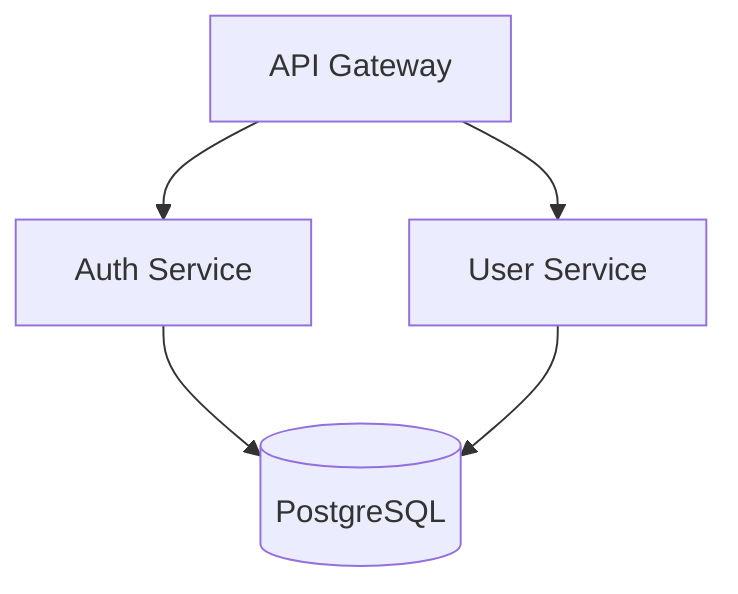
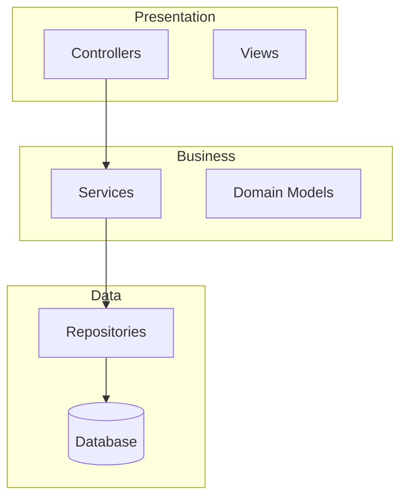

# Senior Architect

Architecture design and analysis for making informed technical decisions.

**Source:** [alirezarezvani/claude-skills](https://github.com/alirezarezvani/claude-skills) — `engineering-team/senior-architect`

---

## Quick Start

When invoked, determine which workflow the user needs:

| User asks about | Workflow |
|----------------|----------|
| System design, new project architecture | Architecture Pattern Selection |
| Database choice | Database Selection |
| Dependency issues, coupling | Dependency Analysis |
| Visualize architecture | Diagram Generation |
| Tech stack decision | Tech Decision Framework |
| Monolith vs microservices | Monolith vs Microservices Decision |
| Architecture review | Full Assessment |

---

## Architecture Assessment

When reviewing an existing codebase or project:

1. **Detect patterns** — Identify architectural patterns (MVC, layered, hexagonal, microservices indicators)
2. **Check organization** — Flag code organization issues (god classes, mixed concerns)
3. **Validate layers** — Check for layer violations (presentation calling data directly, etc.)
4. **Identify gaps** — Missing architectural components (no clear separation, missing abstraction layers)
5. **Generate ADR** — If a decision is being made, produce an Architecture Decision Record

**Assessment output format:**
```
Architecture Assessment
=======================
Detected pattern: {pattern} (confidence: {%})

Structure analysis:
  ✓ {layer} - {description}
  ⚠ {layer} - {issue}

Issues:
- {issue description}

Recommendations:
1. {recommendation}
2. {recommendation}
```

---

## Decision Workflows

### Database Selection Workflow

Use when choosing a database for a new project or migrating existing data.

**Step 1: Identify data characteristics**
| Characteristic | Points to SQL | Points to NoSQL |
|----------------|---------------|-----------------|
| Structured with relationships | ✓ | |
| ACID transactions required | ✓ | |
| Flexible/evolving schema | | ✓ |
| Document-oriented data | | ✓ |
| Time-series data | | ✓ (specialized) |

**Step 2: Evaluate scale requirements**
- <1M records, single region → PostgreSQL or MySQL
- 1M-100M records, read-heavy → PostgreSQL with read replicas
- >100M records, global distribution → CockroachDB, Spanner, or DynamoDB
- High write throughput (>10K/sec) → Cassandra or ScyllaDB

**Step 3: Check consistency requirements**
- Strong consistency required → SQL or CockroachDB
- Eventual consistency acceptable → DynamoDB, Cassandra, MongoDB

**Step 4: Document decision** — Create an ADR with: Context, Options, Decision, Trade-offs.

**Quick reference:**
```
PostgreSQL  → Default choice for most applications
MongoDB     → Document store, flexible schema
Redis       → Caching, sessions, real-time features
DynamoDB    → Serverless, auto-scaling, AWS-native
TimescaleDB → Time-series data with SQL interface
```

---

### Architecture Pattern Selection Workflow

**Step 1: Assess team and project size**
| Team Size | Recommended Starting Point |
|-----------|---------------------------|
| 1-3 developers | Modular monolith |
| 4-10 developers | Modular monolith or service-oriented |
| 10+ developers | Consider microservices |

**Step 2: Evaluate deployment requirements**
- Single deployment unit acceptable → Monolith
- Independent scaling needed → Microservices
- Mixed → Hybrid

**Step 3: Consider data boundaries**
- Shared database acceptable → Monolith or modular monolith
- Strict data isolation required → Microservices with separate DBs
- Event-driven communication fits → Event-sourcing/CQRS

**Step 4: Match pattern to requirements**

| Requirement | Recommended Pattern |
|-------------|-------------------|
| Rapid MVP development | Modular Monolith |
| Independent team deployment | Microservices |
| Complex domain logic | Domain-Driven Design |
| High read/write ratio difference | CQRS |
| Audit trail required | Event Sourcing |
| Third-party integrations | Hexagonal/Ports & Adapters |

---

### Monolith vs Microservices Decision

**Choose Monolith when:**
- [ ] Team is small (<10 developers)
- [ ] Domain boundaries are unclear
- [ ] Rapid iteration is priority
- [ ] Operational complexity must be minimized
- [ ] Shared database is acceptable

**Choose Microservices when:**
- [ ] Teams can own services end-to-end
- [ ] Independent deployment is critical
- [ ] Different scaling requirements per component
- [ ] Technology diversity is needed
- [ ] Domain boundaries are well understood

**Hybrid approach:**
Start with a modular monolith. Extract services only when:
1. A module has significantly different scaling needs
2. A team needs independent deployment
3. Technology constraints require separation

---

## Dependency Analysis

When analyzing project dependencies:

1. **Map dependency tree** — Direct and transitive dependencies
2. **Detect circular dependencies** — Modules referencing each other
3. **Score coupling** — Rate 0-100 (lower is better)
4. **Check outdated packages** — Flag security-relevant updates
5. **Recommend fixes** — Extract shared interfaces, update vulnerable deps

**Output format:**
```
Dependency Analysis Report
==========================
Total dependencies: {n} ({direct} direct, {transitive} transitive)
Coupling score: {score}/100

Issues found:
- CIRCULAR: {module} → {module} → {module}
- OUTDATED: {package} {current} → {latest} (security)

Recommendations:
1. {recommendation}
```

---

## Architecture Diagrams

When generating architecture diagrams, use Mermaid format (VS Code native rendering):

**Component diagram:**


**Layer diagram:**


**Supported types:**
- `component` — Modules and their relationships
- `layer` — Architectural layers (presentation, business, data)
- `deployment` — Deployment topology
- `sequence` — Request flow through components

---

## ADR Template

When documenting architecture decisions:

```markdown
# ADR-{number}: {Title}

## Status
{Proposed | Accepted | Deprecated | Superseded by ADR-{n}}

## Context
{What is the issue that we're seeing that is motivating this decision?}

## Decision
{What is the change that we're proposing and/or doing?}

## Consequences
### Positive
- {benefit}

### Negative
- {cost/trade-off}

### Neutral
- {observation}
```

---

## Tech Stack Coverage

**Languages:** TypeScript, JavaScript, Python, Go, Swift, Kotlin, Rust
**Frontend:** React, Next.js, Vue, Angular, React Native, Flutter
**Backend:** Node.js, Express, FastAPI, Go, GraphQL, REST
**Databases:** PostgreSQL, MySQL, MongoDB, Redis, DynamoDB, Cassandra
**Infrastructure:** Docker, Kubernetes, Terraform, AWS, GCP, Azure
**CI/CD:** GitHub Actions, GitLab CI, CircleCI, Jenkins
