# Northwatch Wardens

<!-- markdownlint-disable MD033 MD045 -->

## NPC Roster (DM)

DM-facing roster of named NPCs (and a few "NPC-grade" antagonists) grouped by **location/adventure** for *Northwatch Wardens: Season One*.

### Notes

- Synthesized from your campaign XML + DM roster notes; summaries are intentionally **original**.
- Portraits are shown when available in `Season 1/Campaign Assets/Images`.

\page

## Waystone Inn (Guild HQ)

### Guild Leadership

<table class="npc-roster" style="width: 100%; border-collapse: collapse; background: transparent; border: none;">
  <tr>
    <td width="96" valign="top" style="vertical-align: top; border: none; background: transparent;">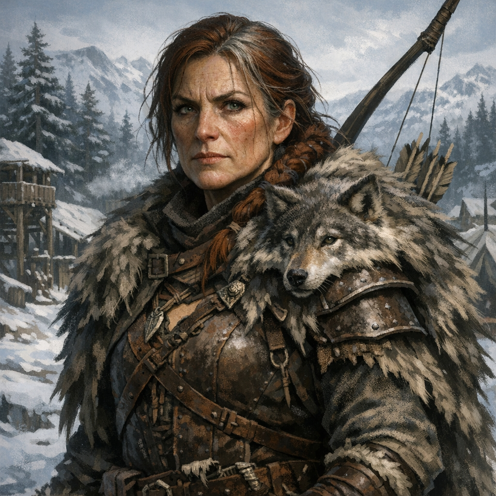</td>
    <td valign="top" style="vertical-align: top; border: none; background: transparent;"><strong>Marshal Brenna Thorne</strong> — field commander; pragmatic, protective, suspicious of "easy answers."</td>
  </tr>
  <tr>
    <td width="96" valign="top" style="vertical-align: top; border: none; background: transparent;"></td>
    <td valign="top" style="vertical-align: top; border: none; background: transparent;"><strong>Steward Mara Fenwick</strong> — quartermaster &amp; logistics; bright smile, sharp eyes, knows the underworld.</td>
  </tr>
  <tr>
    <td width="96" valign="top" style="vertical-align: top; border: none; background: transparent;"></td>
    <td valign="top" style="vertical-align: top; border: none; background: transparent;"><strong>Lorewarden Elric Vael</strong> — scholar &amp; pattern-spotter; calm voice, always taking notes.</td>
  </tr>
</table>

### Wardens & Regulars

<table class="npc-roster" style="width: 100%; border-collapse: collapse; background: transparent; border: none;">
  <tr>
    <td width="96" valign="top" style="vertical-align: top; border: none; background: transparent;"></td>
    <td valign="top" style="vertical-align: top; border: none; background: transparent;"><strong>Sera Gelanadel</strong> — apprentice wizard; eager, brilliant, overextended; great quest-brief/translator NPC.</td>
  </tr>
  <tr>
    <td width="96" valign="top" style="vertical-align: top; border: none; background: transparent;">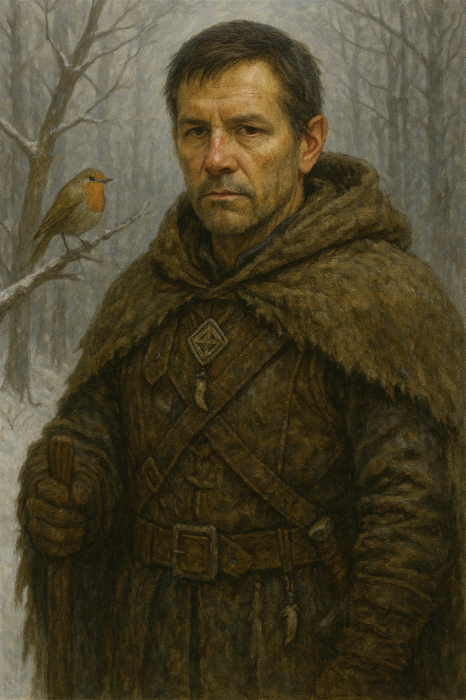</td>
    <td valign="top" style="vertical-align: top; border: none; background: transparent;"><strong>Bordel Barleywind</strong> — quiet ranger; steady scout; prefers the trail to the taproom.</td>
  </tr>
  <tr>
    <td width="96" valign="top" style="vertical-align: top; border: none; background: transparent;"></td>
    <td valign="top" style="vertical-align: top; border: none; background: transparent;"><strong>Rowan Fairweather</strong> — druidic guide; gentle, curious, and deeply attuned to the wilderness.</td>
  </tr>
  <tr>
    <td width="96" valign="top" style="vertical-align: top; border: none; background: transparent;">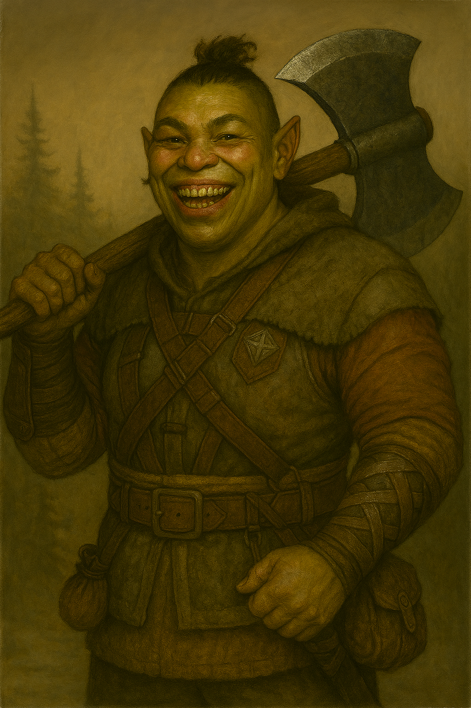</td>
    <td valign="top" style="vertical-align: top; border: none; background: transparent;"><strong>Takk Oaksplitter</strong> — lantern guard bruiser; loud, friendly, and always ready to volunteer first.</td>
  </tr>
  <tr>
    <td width="96" valign="top" style="vertical-align: top; border: none; background: transparent;">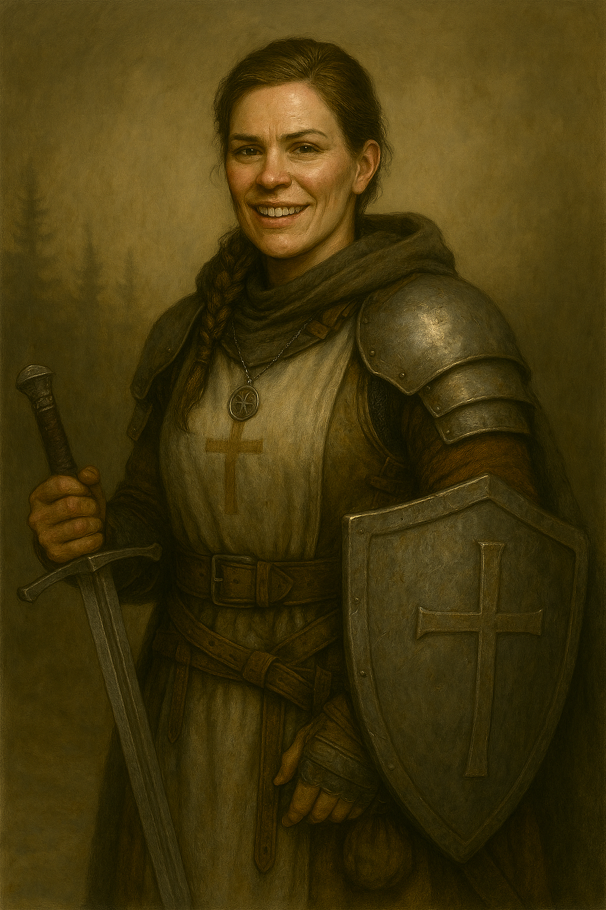</td>
    <td valign="top" style="vertical-align: top; border: none; background: transparent;"><strong>Galvena Aballon</strong> — disciplined paladin; devout, unwavering, and serious about safety and oaths.</td>
  </tr>
  <tr>
    <td width="96" valign="top" style="vertical-align: top; border: none; background: transparent;"></td>
    <td valign="top" style="vertical-align: top; border: none; background: transparent;"><strong>Ariodh Highwhirl</strong> — monk; calm, focused, philosophical; prefers diplomacy before a fight.</td>
  </tr>
  <tr>
    <td width="96" valign="top" style="vertical-align: top; border: none; background: transparent;"></td>
    <td valign="top" style="vertical-align: top; border: none; background: transparent;"><strong>Guz</strong> — bruiser with a conscience; gruff, awkward, trying his best; potential redemption ally.</td>
  </tr>
  <tr>
    <td width="96" valign="top" style="vertical-align: top; border: none; background: transparent;">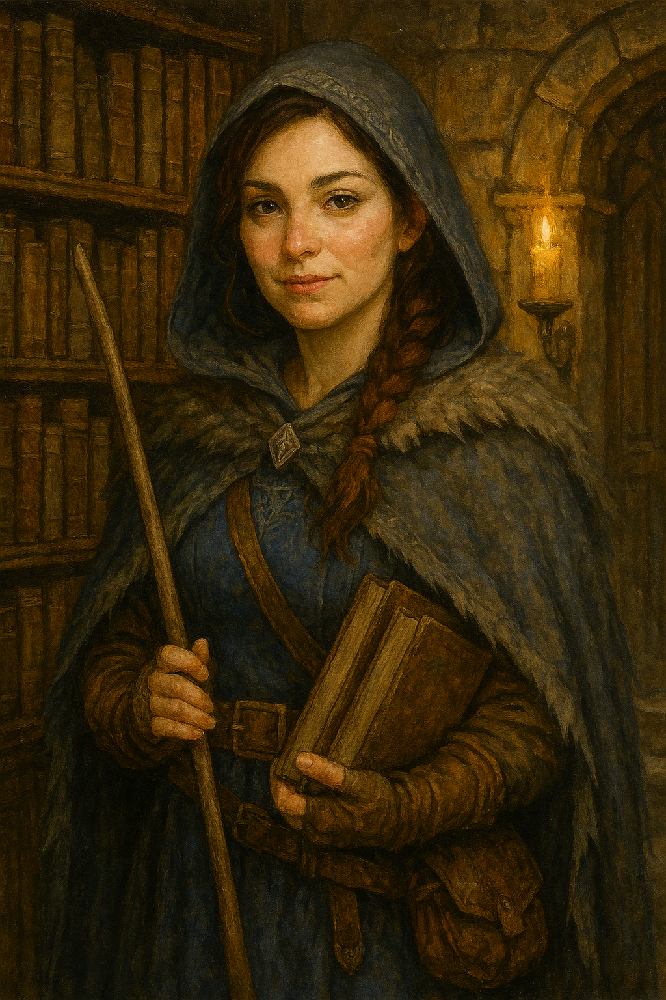</td>
    <td valign="top" style="vertical-align: top; border: none; background: transparent;"><strong>Mila Teno</strong> — rookie scout; brave-but-shaken; good for "human cost" moments and hard choices.</td>
  </tr>
  <tr>
    <td width="96" valign="top" style="vertical-align: top; border: none; background: transparent;">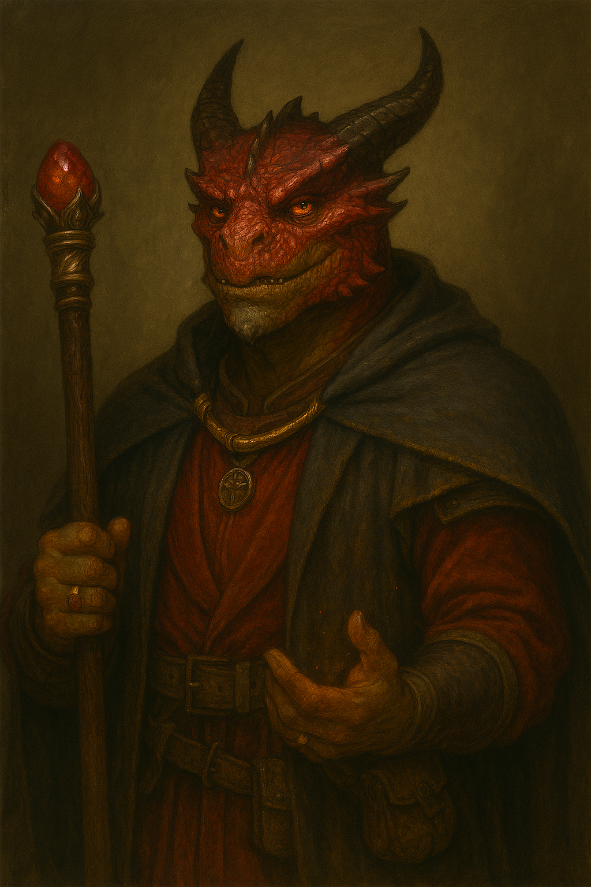</td>
    <td valign="top" style="vertical-align: top; border: none; background: transparent;"><strong>Aurixean Valignaak</strong> — dragonborn sorcerer; proud, charismatic, and dramatic; impossible to ignore.</td>
  </tr>
  <tr>
    <td width="96" valign="top" style="vertical-align: top; border: none; background: transparent;"></td>
    <td valign="top" style="vertical-align: top; border: none; background: transparent;"><strong>Flynt Wymblen</strong> — bard &amp; rumor-mill; comic relief that can also deliver prophecy-by-song.</td>
  </tr>
</table>

### Opening Adventure: Wolves at the Waystone

<table class="npc-roster" style="width: 100%; border-collapse: collapse; background: transparent; border: none;">
  <tr>
    <td width="96" valign="top" style="vertical-align: top; border: none; background: transparent;"></td>
    <td valign="top" style="vertical-align: top; border: none; background: transparent;"><strong>Waystone Wolf (Opening)</strong> — the "wrong-feeling" wolf that kicks off the tone (use as omen; not just a random beast).</td>
  </tr>
</table>

\page

## Welton (Wolves of Welton)

### Welton Core NPCs

<table class="npc-roster" style="width: 100%; border-collapse: collapse; background: transparent; border: none;">
  <tr>
    <td width="96" valign="top" style="vertical-align: top; border: none; background: transparent;">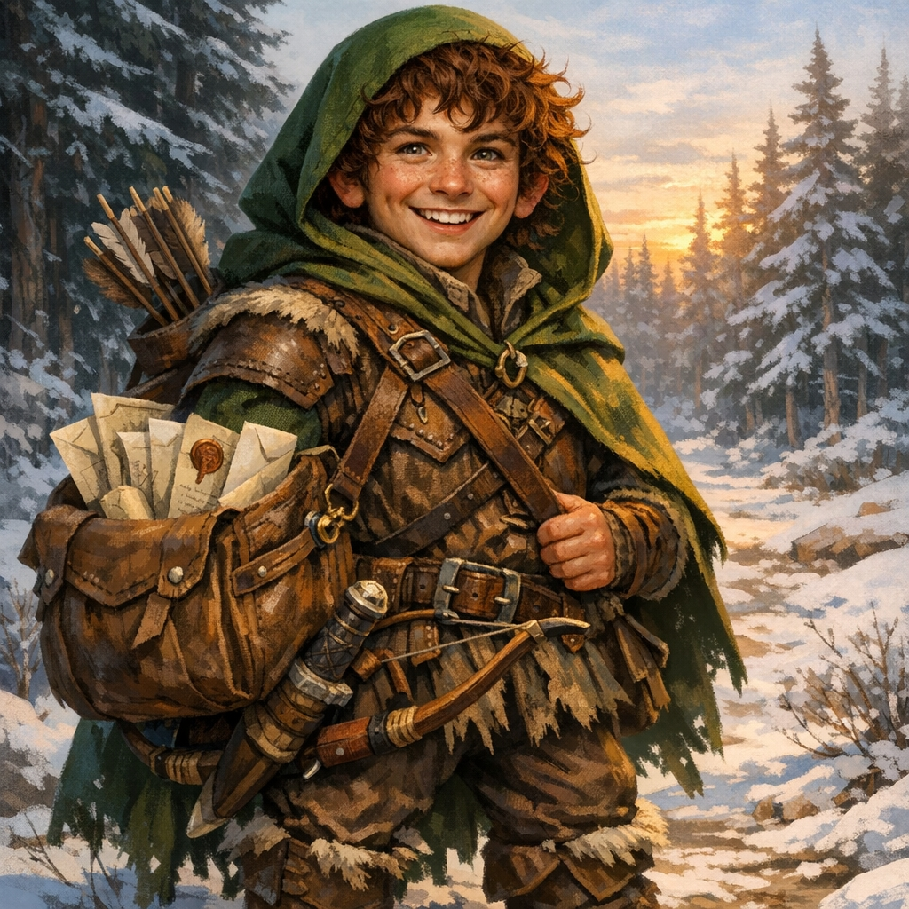</td>
    <td valign="top" style="vertical-align: top; border: none; background: transparent;"><strong>Corel</strong> — senior shepherd; knows wolf behavior better than anyone; anchor for diplomacy vs. slaughter.</td>
  </tr>
  <tr>
    <td width="96" valign="top" style="vertical-align: top; border: none; background: transparent;">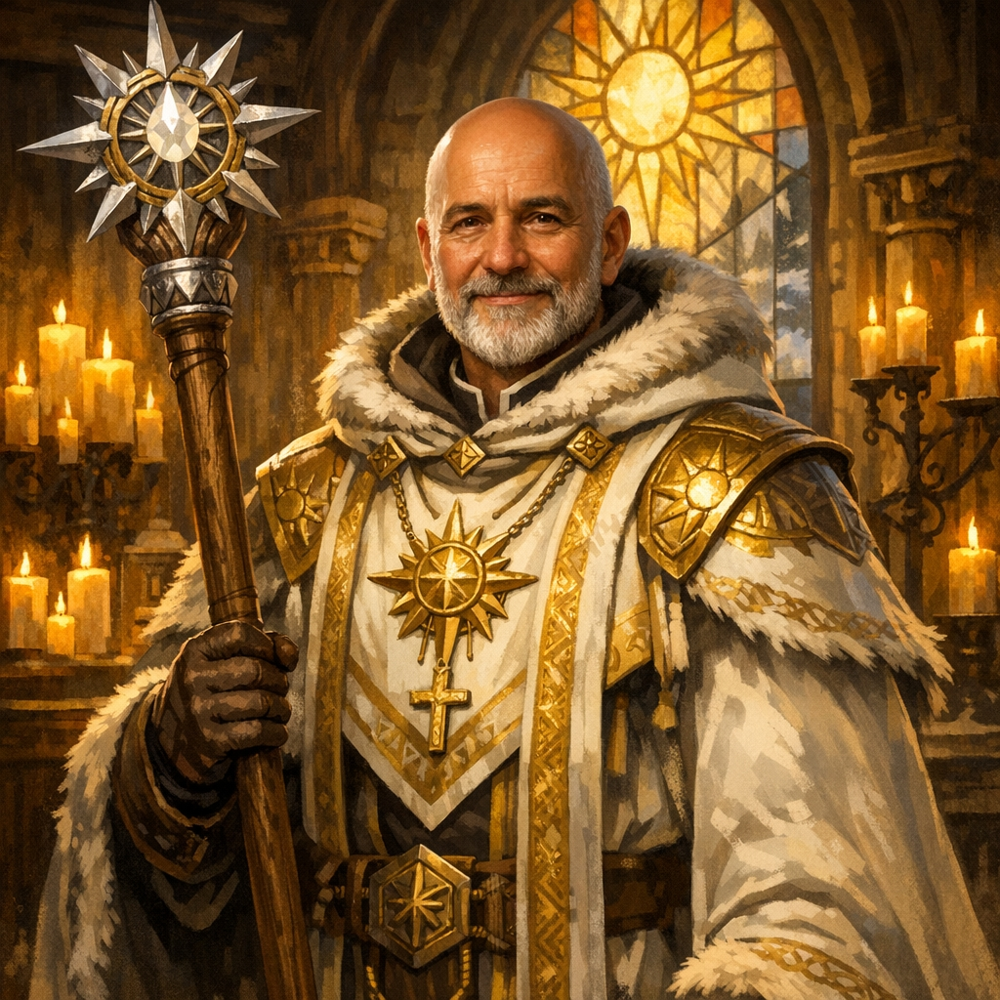</td>
    <td valign="top" style="vertical-align: top; border: none; background: transparent;"><strong>Father Johan Merriksonn</strong> — village priest; grief + duty; steady moral compass with cracks showing.</td>
  </tr>
  <tr>
    <td width="96" valign="top" style="vertical-align: top; border: none; background: transparent;">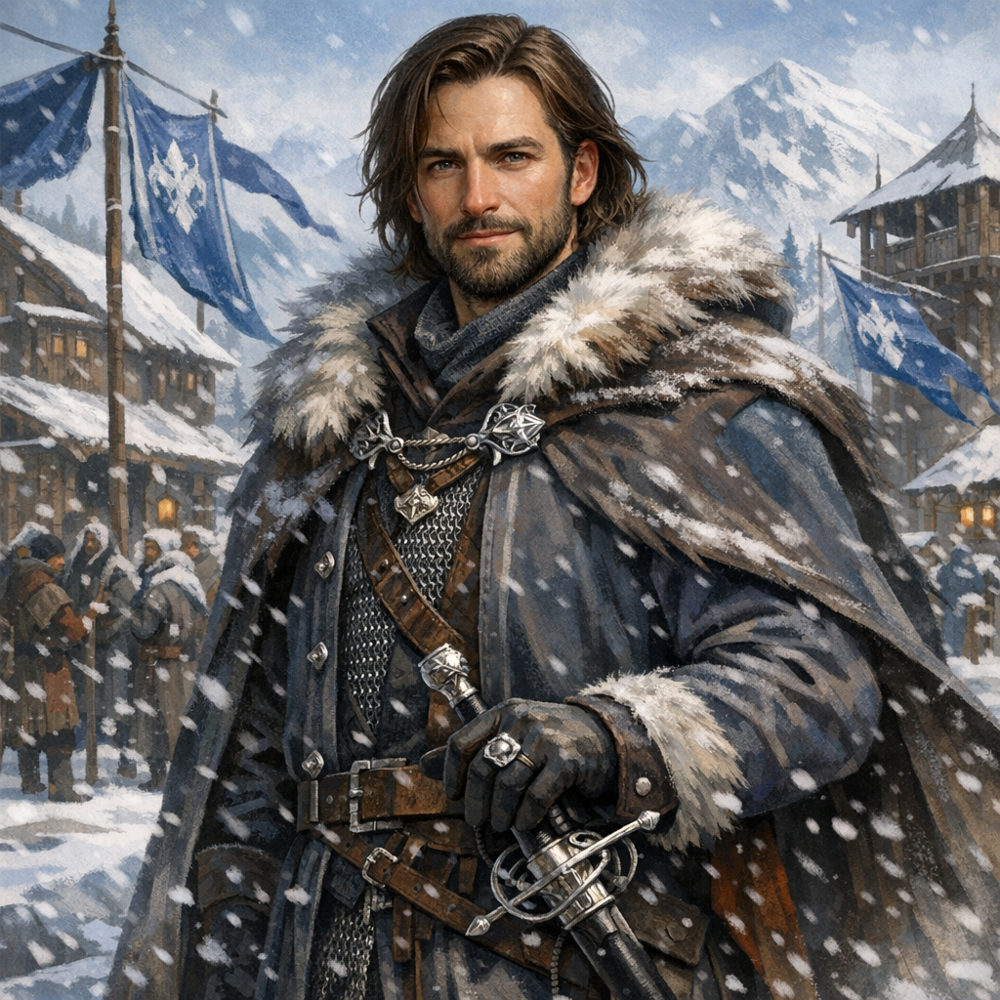</td>
    <td valign="top" style="vertical-align: top; border: none; background: transparent;"><strong>Alexi Merriksonn</strong> — missing sorcerer; tragedy + mystery + arcane fallout; answers with consequences.</td>
  </tr>
  <tr>
    <td width="96" valign="top" style="vertical-align: top; border: none; background: transparent;">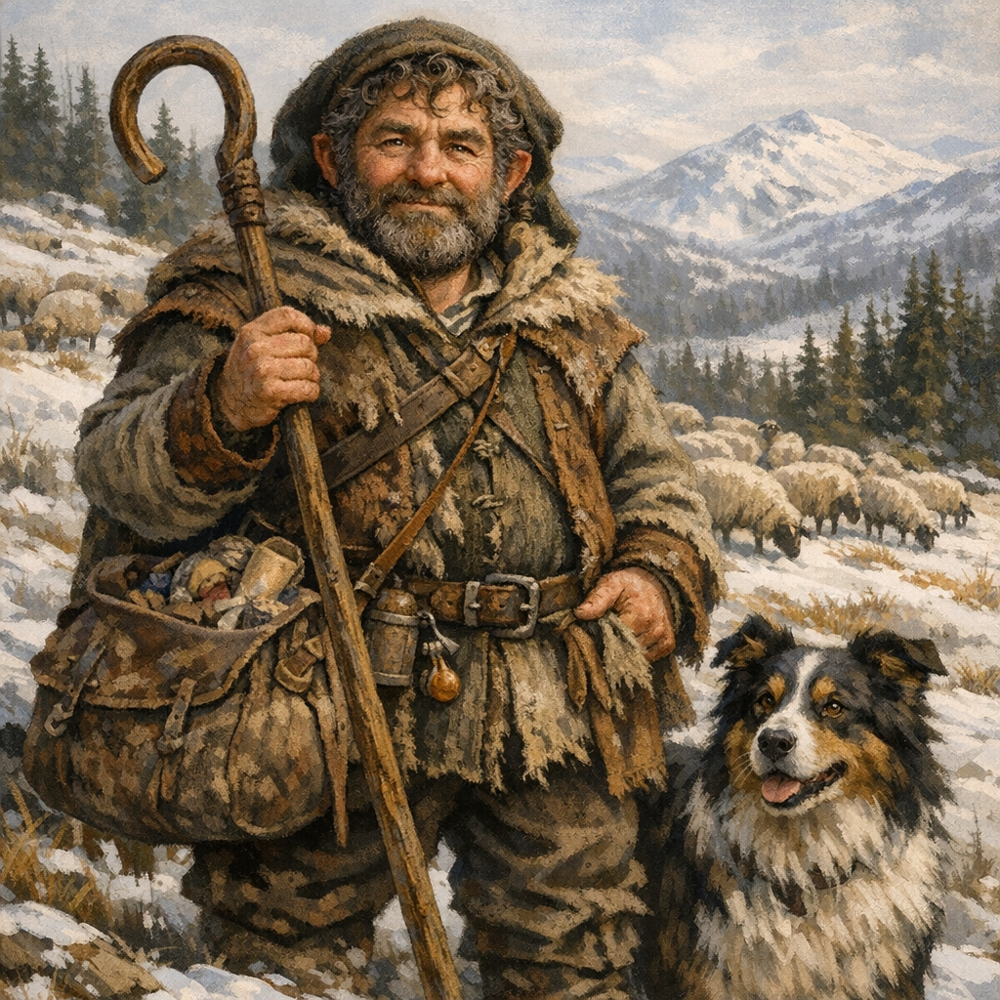</td>
    <td valign="top" style="vertical-align: top; border: none; background: transparent;"><strong>Willen Featherock</strong> — traumatized shepherd; first-hand witness; the "ordinary person" perspective.</td>
  </tr>
</table>

### Welton Council / Community

<table class="npc-roster" style="width: 100%; border-collapse: collapse; background: transparent; border: none;">
  <tr>
    <td width="96" valign="top" style="vertical-align: top; border: none; background: transparent;">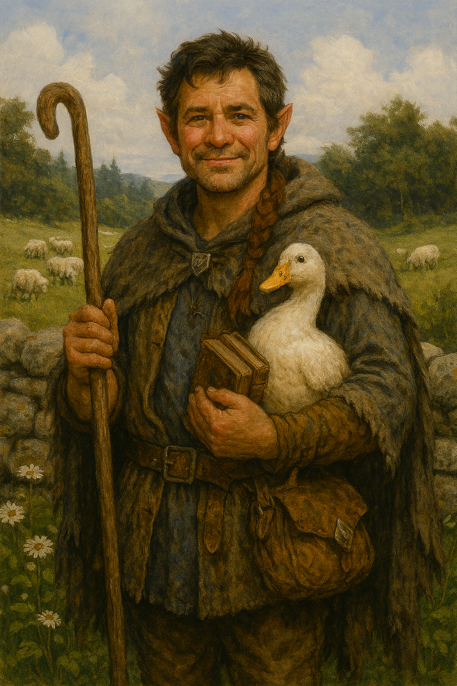</td>
    <td valign="top" style="vertical-align: top; border: none; background: transparent;"><strong>Tillus Merrion</strong> — council member; politics and coin-first pragmatism; can obstruct or enable with leverage.</td>
  </tr>
  <tr>
    <td width="96" valign="top" style="vertical-align: top; border: none; background: transparent;"></td>
    <td valign="top" style="vertical-align: top; border: none; background: transparent;"><strong>Leanor Slatebeard</strong> — innkeeper of the Shepherd's Crook; warm, suspicious of outsiders, knows everyone's business.</td>
  </tr>
  <tr>
    <td width="96" valign="top" style="vertical-align: top; border: none; background: transparent;"></td>
    <td valign="top" style="vertical-align: top; border: none; background: transparent;"><strong>Banteth Slatebeard</strong> — Leanor's spouse; steadier temperament; turns conflict into food and small kindnesses.</td>
  </tr>
  <tr>
    <td width="96" valign="top" style="vertical-align: top; border: none; background: transparent;">&nbsp;</td>
    <td valign="top" style="vertical-align: top; border: none; background: transparent;"><strong>Marta Henwick</strong> — small-shop proprietor; gossip hub; can leak clues or be threatened for them.</td>
  </tr>
  <tr>
    <td width="96" valign="top" style="vertical-align: top; border: none; background: transparent;">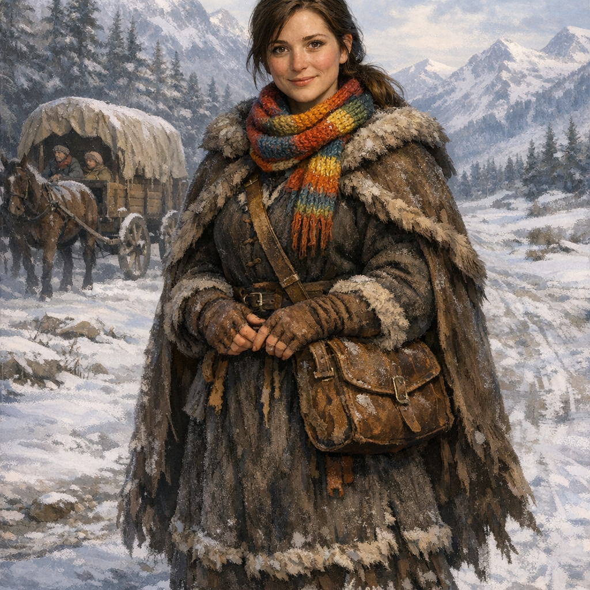</td>
    <td valign="top" style="vertical-align: top; border: none; background: transparent;"><strong>Irven Liel</strong> — Welton-associated NPC in XML; useful as a courier, middleman, or "I saw something" witness when you need a human breadcrumb trail.</td>
  </tr>
  <tr>
    <td width="96" valign="top" style="vertical-align: top; border: none; background: transparent;">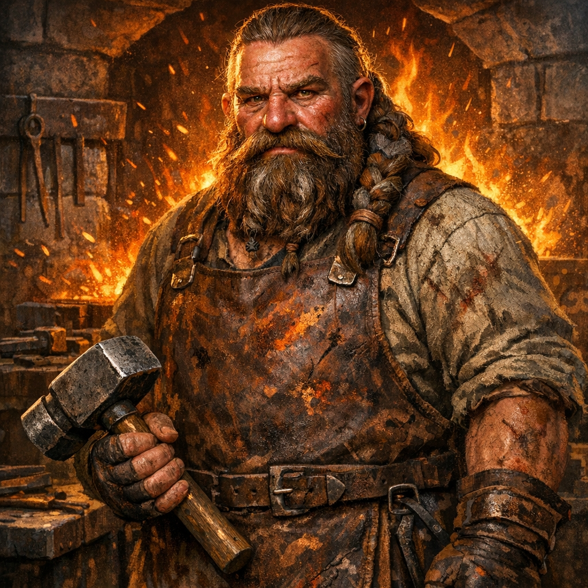</td>
    <td valign="top" style="vertical-align: top; border: none; background: transparent;"><strong>Arl Bortock</strong> — local figure (Welton-associated in XML); good "town voice" NPC for grounded scenes.</td>
  </tr>
  <tr>
    <td width="96" valign="top" style="vertical-align: top; border: none; background: transparent;"></td>
    <td valign="top" style="vertical-align: top; border: none; background: transparent;"><strong>Fenton Tethwick</strong> — Welton-associated NPC in XML; flexible lever (witness, rival, or reluctant helper).</td>
  </tr>
</table>

### Awakened Wolves (Faction NPCs)

<table class="npc-roster" style="width: 100%; border-collapse: collapse; background: transparent; border: none;">
  <tr>
    <td width="96" valign="top" style="vertical-align: top; border: none; background: transparent;"></td>
    <td valign="top" style="vertical-align: top; border: none; background: transparent;"><strong>Bolt</strong> — awakened alpha; diplomatic, frightened of what he's becoming; strong recurring nonhuman ally.</td>
  </tr>
  <tr>
    <td width="96" valign="top" style="vertical-align: top; border: none; background: transparent;">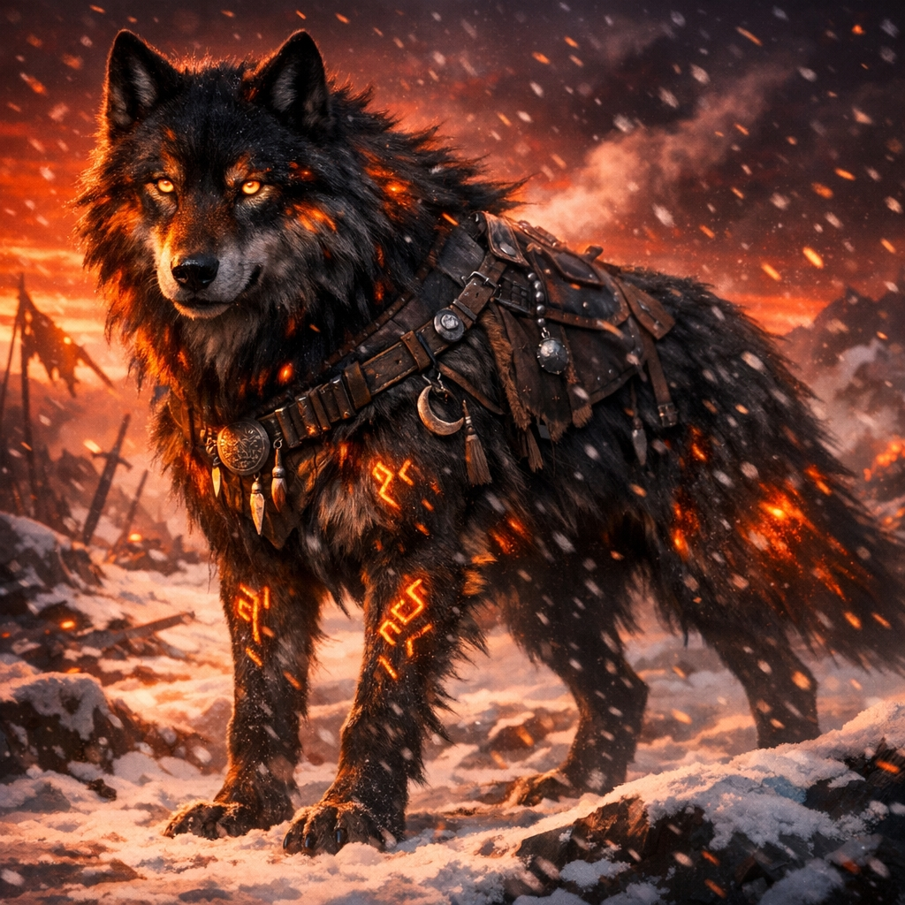</td>
    <td valign="top" style="vertical-align: top; border: none; background: transparent;"><strong>Flame</strong> — awakened alpha; proud, aggressive, tempted by domination; recurring rival faction leader.</td>
  </tr>
</table>

\page

## Pinebrook (Peril in Pinebrook)

### Pinebrook Authorities

<table class="npc-roster" style="width: 100%; border-collapse: collapse; background: transparent; border: none;">
  <tr>
    <td width="96" valign="top" style="vertical-align: top; border: none; background: transparent;">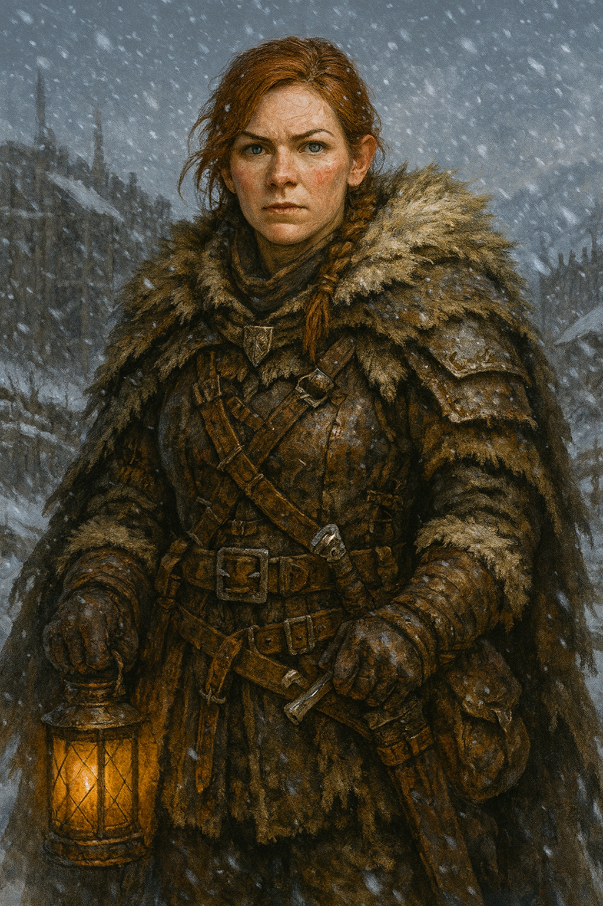</td>
    <td valign="top" style="vertical-align: top; border: none; background: transparent;"><strong>Captain Emmajeen Kole</strong> — guard captain; direct, disciplined; wants results and safety, not heroics.</td>
  </tr>
</table>

### Key "NPC-grade" Creature

<table class="npc-roster" style="width: 100%; border-collapse: collapse; background: transparent; border: none;">
  <tr>
    <td width="96" valign="top" style="vertical-align: top; border: none; background: transparent;"></td>
    <td valign="top" style="vertical-align: top; border: none; background: transparent;"><strong>Silver Dragon Wyrmling (baby)</strong> — bond hook; nonverbal NPC that can define party identity (protectors vs. opportunists).</td>
  </tr>
  <tr>
    <td width="96" valign="top" style="vertical-align: top; border: none; background: transparent;">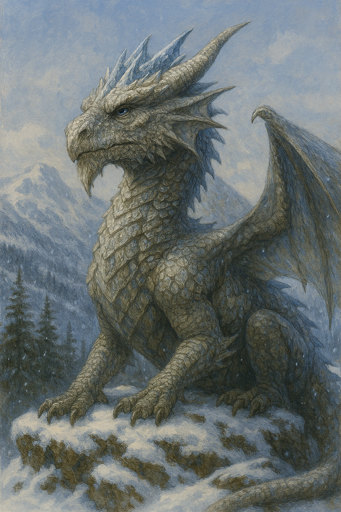</td>
    <td valign="top" style="vertical-align: top; border: none; background: transparent;"><strong>Hysvearorn ("Rorn")</strong> — adult silver dragon; her full name translates as “Soaring Silver.” She insists non-dragons call her Rorn; protective, intelligent, and willing to negotiate… right up until the party proves untrustworthy.</td>
  </tr>
</table>

\page

## Palebank Village (Frozen Sick)

### Palebank Leadership & Locals

<table class="npc-roster" style="width: 100%; border-collapse: collapse; background: transparent; border: none;">
  <tr>
    <td width="96" valign="top" style="vertical-align: top; border: none; background: transparent;">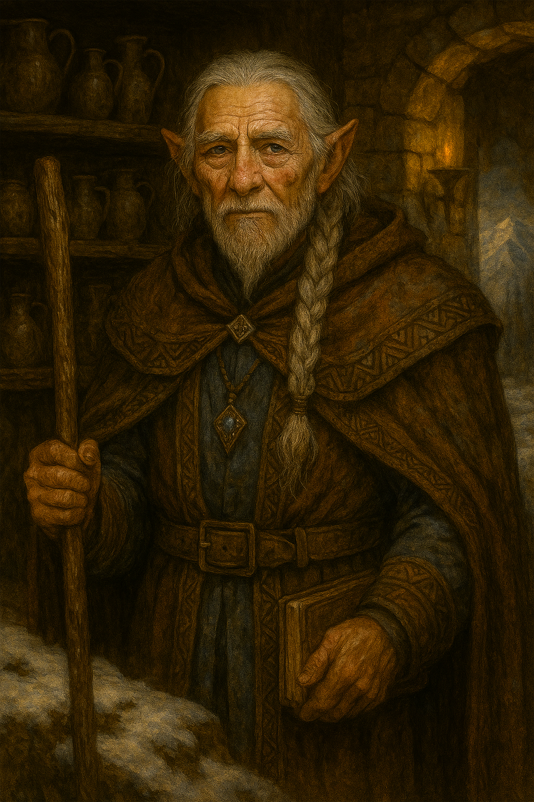</td>
    <td valign="top" style="vertical-align: top; border: none; background: transparent;"><strong>Elro Aldataur</strong> — quest-giver/leader voice; careful, tired, protective; pushes the party into the wider frozen mystery.</td>
  </tr>
  <tr>
    <td width="96" valign="top" style="vertical-align: top; border: none; background: transparent;">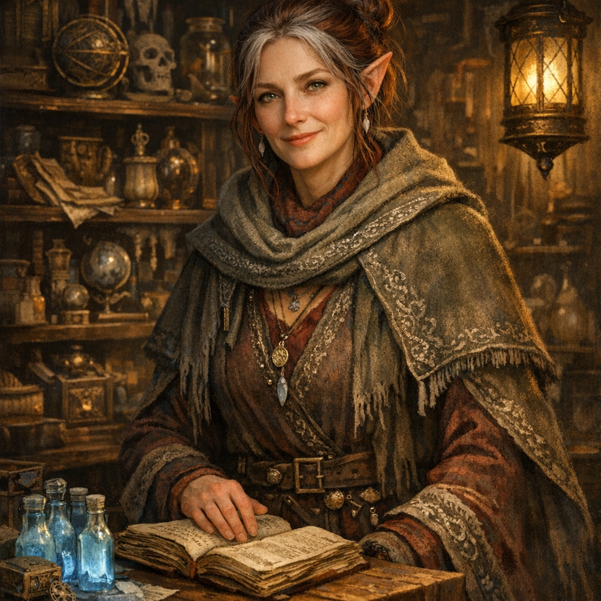</td>
    <td valign="top" style="vertical-align: top; border: none; background: transparent;"><strong>Verla Pelc</strong> — merchant with dangerous connections; leverage, desperation, and secrets.</td>
  </tr>
  <tr>
    <td width="96" valign="top" style="vertical-align: top; border: none; background: transparent;">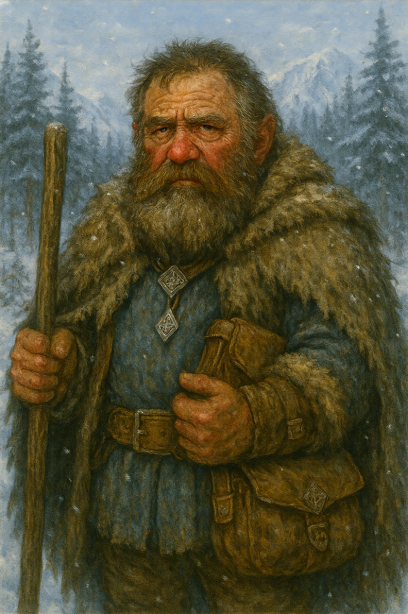</td>
    <td valign="top" style="vertical-align: top; border: none; background: transparent;"><strong>Urgon</strong> — blacksmith (funeral hook); community keystone; even deceased, his presence matters.</td>
  </tr>
  <tr>
    <td width="96" valign="top" style="vertical-align: top; border: none; background: transparent;">&nbsp;</td>
    <td valign="top" style="vertical-align: top; border: none; background: transparent;"><strong>Tulgi</strong> — healer; tense, defensive; knows more than she admits; ally or suspect depending on approach.</td>
  </tr>
</table>

\page

## Croaker Cave (Frozen Sick)

### Antagonists

<table class="npc-roster" style="width: 100%; border-collapse: collapse; background: transparent; border: none;">
  <tr>
    <td width="96" valign="top" style="vertical-align: top; border: none; background: transparent;">&nbsp;</td>
    <td valign="top" style="vertical-align: top; border: none; background: transparent;"><strong>Hulil Lutan</strong> — cult-tied operative; smart, ruthless; prefers control and escape routes over fair fights.</td>
  </tr>
  <tr>
    <td width="96" valign="top" style="vertical-align: top; border: none; background: transparent;">&nbsp;</td>
    <td valign="top" style="vertical-align: top; border: none; background: transparent;"><strong>Raegrin Mau</strong> — cultist lieutenant; zeal + fear; can crack under pressure or double down.</td>
  </tr>
</table>

### Notable Creature (optional)

<table class="npc-roster" style="width: 100%; border-collapse: collapse; background: transparent; border: none;">
  <tr>
    <td width="96" valign="top" style="vertical-align: top; border: none; background: transparent;">&nbsp;</td>
    <td valign="top" style="vertical-align: top; border: none; background: transparent;"><strong>Old Croaker</strong> — "boss" cave beast; play as a living hazard with habits, territory, and bargaining options.</td>
  </tr>
</table>

\page

## Salsvault (Frozen Sick)

### Named / Role NPCs

<table class="npc-roster" style="width: 100%; border-collapse: collapse; background: transparent; border: none;">
  <tr>
    <td width="96" valign="top" style="vertical-align: top; border: none; background: transparent;">&nbsp;</td>
    <td valign="top" style="vertical-align: top; border: none; background: transparent;"><strong>Morgo Delwur</strong> — expedition guide/contact; calm competence; can offer hard truths about survival and risk.</td>
  </tr>
  <tr>
    <td width="96" valign="top" style="vertical-align: top; border: none; background: transparent;">&nbsp;</td>
    <td valign="top" style="vertical-align: top; border: none; background: transparent;"><strong>Orvo Mustave</strong> — anxious survivor; key witness; feeds urgency and the feeling that time matters.</td>
  </tr>
  <tr>
    <td width="96" valign="top" style="vertical-align: top; border: none; background: transparent;">&nbsp;</td>
    <td valign="top" style="vertical-align: top; border: none; background: transparent;"><strong>The Buyer</strong> — mysterious patron &amp; relic broker; controlled tone, measured generosity; long-term faction contact.</td>
  </tr>
  <tr>
    <td width="96" valign="top" style="vertical-align: top; border: none; background: transparent;">&nbsp;</td>
    <td valign="top" style="vertical-align: top; border: none; background: transparent;"><strong>Dew</strong> — faerie dragon familiar; playful misdirection + sudden sincerity; strong tonal contrast.</td>
  </tr>
</table>

### Antagonist / Threat (optional)

<table class="npc-roster" style="width: 100%; border-collapse: collapse; background: transparent; border: none;">
  <tr>
    <td width="96" valign="top" style="vertical-align: top; border: none; background: transparent;">&nbsp;</td>
    <td valign="top" style="vertical-align: top; border: none; background: transparent;"><strong>Ferol Sal</strong> — ruin's willful, dangerous "mind behind the suffering" (even if undead); can negotiate from advantage.</td>
  </tr>
</table>

\page

## Noke's Tower (Wild Sheep Chase)

### Key NPCs

<table class="npc-roster" style="width: 100%; border-collapse: collapse; background: transparent; border: none;">
  <tr>
    <td width="96" valign="top" style="vertical-align: top; border: none; background: transparent;"></td>
    <td valign="top" style="vertical-align: top; border: none; background: transparent;"><strong>Finethir Shinebright (polymorphed)</strong> — brilliant wizard as a sheep; arrogant, funny, useful; recurring magical contact.</td>
  </tr>
  <tr>
    <td width="96" valign="top" style="vertical-align: top; border: none; background: transparent;">&nbsp;</td>
    <td valign="top" style="vertical-align: top; border: none; background: transparent;"><strong>Ahmed Noke</strong> — antagonist; petty-genius energy; can play pathetic, terrifying, or both.</td>
  </tr>
  <tr>
    <td width="96" valign="top" style="vertical-align: top; border: none; background: transparent;"></td>
    <td valign="top" style="vertical-align: top; border: none; background: transparent;"><strong>Guz</strong> — bruiser with a conscience; redemption candidate; useful for "enemy with a line."</td>
  </tr>
  <tr>
    <td width="96" valign="top" style="vertical-align: top; border: none; background: transparent;"></td>
    <td valign="top" style="vertical-align: top; border: none; background: transparent;"><strong>Guz's Wolf</strong> — intelligent collared wolf; reads like a person with tactics and fear.</td>
  </tr>
</table>

### Polymorphed Guard (optional)

<table class="npc-roster" style="width: 100%; border-collapse: collapse; background: transparent; border: none;">
  <tr>
    <td width="96" valign="top" style="vertical-align: top; border: none; background: transparent;"></td>
    <td valign="top" style="vertical-align: top; border: none; background: transparent;"><strong>Polymorphed Brown Bear</strong> — memorable "this wizard is reckless" proof.</td>
  </tr>
</table>

\page

## Temple of the Dragonknights (Capstone)

### Key NPCs (Andersmith Family)

<table class="npc-roster" style="width: 100%; border-collapse: collapse; background: transparent; border: none;">
  <tr>
    <td width="96" valign="top" style="vertical-align: top; border: none; background: transparent;"></td>
    <td valign="top" style="vertical-align: top; border: none; background: transparent;"><strong>Joel Andersmith</strong> — grieving parent; moral pressure; makes the threat personal and immediate.</td>
  </tr>
  <tr>
    <td width="96" valign="top" style="vertical-align: top; border: none; background: transparent;">&nbsp;</td>
    <td valign="top" style="vertical-align: top; border: none; background: transparent;"><strong>Clementine Andersmith</strong> — endangered child; rescue stakes; future campaign hook if saved.</td>
  </tr>
  <tr>
    <td width="96" valign="top" style="vertical-align: top; border: none; background: transparent;"></td>
    <td valign="top" style="vertical-align: top; border: none; background: transparent;"><strong>Sera Gelanadel</strong> — (also listed at Waystone) works well as field scholar/arcane support for this arc.</td>
  </tr>
</table>

### Major Antagonist (optional)

<table class="npc-roster" style="width: 100%; border-collapse: collapse; background: transparent; border: none;">
  <tr>
    <td width="96" valign="top" style="vertical-align: top; border: none; background: transparent;">&nbsp;</td>
    <td valign="top" style="vertical-align: top; border: none; background: transparent;"><strong>Venomfang</strong> — campaign-tier threat; intelligent predator; treats bargains as traps.</td>
  </tr>
</table>

\page

## Portrait Checklist (What to Generate)

### Already in Images folder

- Brenna Thorne, Mara Fenwick, Elric Vael
- Bordel Barleywind, Rowan Fairweather
- Sera Gelanadel, Mila Teno
- Corel, Alexi Merriksonn, Father Johan Merriksonn
- Galvena Aballon, Takk Oaksplitter, Ariodh Highwhirl
- Guz
- Willen Featherock
- Bolt, Flame
- Tillus Merrion, Leanor Slatebeard
- Banteth Slatebeard
- Arl Bortock, Fenton Tethwick, Irven Liel
- Flynt Wymblen
- Captain Emmajeen Kole
- Guz's Wolf
- Elro Aldataur, Urgon
- Aurixean Valignaak
- Shinebright
- Baleth Cindermoon
- Joel Andersmith
- Verla Pelc
- Waystone Wolf (Opening)
- Polymorphed Brown Bear
- Silver Dragon Wyrmling (baby)
- Hysvearorn (Rorn)

\page

### Portrait Gallery (Already in Images folder)

  
  
  
  
  
  
  
  
  
  
  
  
  

\page

  
  
  
  
  
  
  
  
  
  
  
  
  
  
  
  
  
  
  
  
  
  
  
  

\page

### High-priority portraits to generate (recurring / social-heavy)
- **Tulgi**
- **The Buyer**
- **Morgo Delwur**
- **Orvo Mustave**
- **Hulil Lutan**
- **Raegrin Mau**
- **Ahmed Noke**
- **Clementine Andersmith**

### Low-priority / optional portraits (mostly combat pieces)

- Ferol Sal, Venomfang, Old Croaker, constructs/undead, polymorphed animals, etc.

