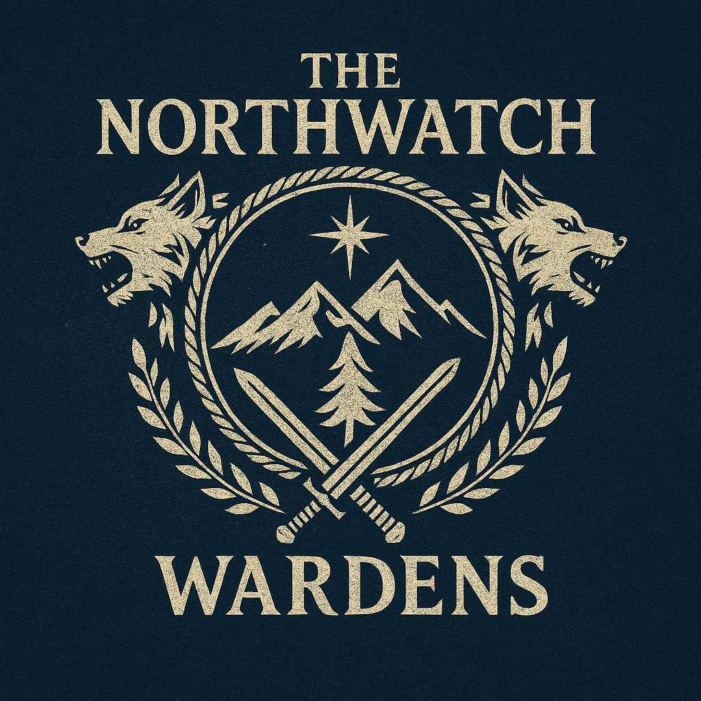

# Northreach Setting Primer (Northwatch Wardens: Season One)

This document exists to keep *all* imported adventures feeling like they belong to the same place.

---

## Player-Facing Map (table canon)

## Northreach in One Paragraph

Northreach is a cold, sparsely settled frontier. **Waystone Inn** sits at the practical center of travel and trade: a safe hearth between small communities, logging roads, and old ruins. Most people here know only local problems (wolves, bandits, missing hunters), but beneath the region, an ancient disturbance—**the Aeorian Echo**—is waking up and leaking outward in small, deniable ways.

---

## Is Northreach “in Wildemount”?

It can be, but it doesn’t have to.

- **Wildemount-compatible mode:** Treat Northreach as your homebrew frontier region and keep imported proper nouns (e.g., Eiselcross, Uthodurn) as distant places referenced in rumors, trade, and backstory.
- **Northreach-standalone mode:** Keep the Northreach map as the only “required geography” and translate off-map references into plain-language phrases (e.g., “a southern empire,” “a distant smuggling town”).

DM rule of thumb: players only need to understand what’s on the Northreach map. Everything else is optional lore.

---

## The Hub-and-Spokes Map (canonical locations)

Use this mental map when you place scenes, rumors, and travel.

- **Waystone Inn (center):** Warden HQ; where contracts begin/end.
- **Welton (southwest):** farming village; *Wolves of Welton* politics and the awakened-wolf truce.
  - **Westly’s Farm:** west of Welton; an obvious “frontier incident” site.
  - **Shepherd’s Crook Inn:** Welton’s social and rumor engine.
- **Pinebrook (southeast):** community crisis / investigation (*Peril in Pinebrook*).
- **Noke’s Tower (near Waystone, upriver):** isolated “weird wizard” problem (*Wild Sheep Chase*).
- **Temple of the Dragonknights (northwest mountains):** high-stakes cult/dragon escalation.
- **Palebank Village (northeast coast):** coastal settlement where *Frozen Sick* begins.
  - **Croaker Cave (north of Palebank):** bandit pressure point and first hard pivot into the wilderness.
  - **Salsvault (far north of Palebank):** Aeorian ruin; the **source** location for the Echo.

---

\page

## Travel Logic (keep it consistent)

Pick travel times that feel right for your table and then keep them stable.

Suggested defaults (adjust freely):

- Waystone Inn ↔ Welton: **1–2 days**
- Waystone Inn ↔ Pinebrook: **2–3 days**
- Waystone Inn ↔ Noke’s Tower: **½–1 day** (quick side trek)
- Waystone Inn ↔ Palebank: **3–5 days** (weather can stretch this)
- Palebank ↔ Croaker Cave: **hours to 1 day**
- Palebank ↔ Salsvault: **multiple days** (whiteout risk, supplies matter)

DM tip: treat **Palebank/Salsvault** as the “far frontier” beyond what most Wardens casually patrol. It’s still Northreach, just the edge where maps get unreliable.

Map tip: your player map already has useful placeholders.

- The **unlabeled cave icon** is **Croaker Cave**.
- The **unlabeled mountain/fortress icon** is **Salsvault** (an Aeorian ruin/complex).

If players ask for directions, locals describe both as “north of Palebank,” with Salsvault meaning “keep going past where sensible people turn back.”

---

## How Frozen Sick Fits Northreach (without breaking immersion)

Your concern is valid: *Frozen Sick* comes with a strong “far north expedition” vibe. The trick is to make it the **next concentric ring** of danger beyond Palebank.

Use these anchors:

- **Palebank is Northreach’s northeast edge, not a separate setting.** It’s the coast-side counterpart to Welton: smaller, tougher, and more isolated.
- **Croaker Cave is the bridge from ‘bandits’ to ‘ancient horror.’** The first half of Frozen Sick can still feel like frontier work: interviews, local politics, criminals.
- **Salsvault is why every other module is happening.** Make the “Aeorian Echo” feel like radiation: invisible, spreading, and causing secondary effects.
- **The outpost / icefields are “beyond Palebank,” not a different world.** Use the names already present in your material, but frame them as seasonal camps and deadly terrain **north of Palebank on the same coastline**.

\page

---

## Practical Retcons (if you want tighter cohesion)

These are optional knobs you can turn *without moving any locations on the table*:

- **Make Wardens the connective tissue:** every long trip is justified by a Warden mandate (“Northreach can’t ignore Palebank; it’s a member settlement”).
- **Make the Echo a regional phenomenon:** Welton’s awakened wolves and Palebank’s sickness are two symptoms of the same leak.
- **Keep names but change expectations:** even if “Salsvault” is legendary to scholars, to locals it’s just “the old ruins in the far ice.”

---

## The Setting Tone (so it all feels like one campaign)

- **Low-magic daily life, high-magic consequences.** The weird stuff is rare, but when it happens it’s dangerous.
- **Frontier politics matter.** Votes, favors, and grudges have weight (Welton council, Palebank leaders).
- **Travel is story.** Weather, supplies, and rumors are part of the identity of Northreach.

---

## Session-Level Tool: ‘One Line of Glue’

Before you start any module, choose one sentence that connects it to the Aeorian Echo.

Examples:

- “A blue-tinged chill rides the wind even this far south.”
- “Animals act too smart, as if listening.”
- “Old metal hums faintly when no one touches it.”

That single line makes disparate modules feel like chapters of the same book.
