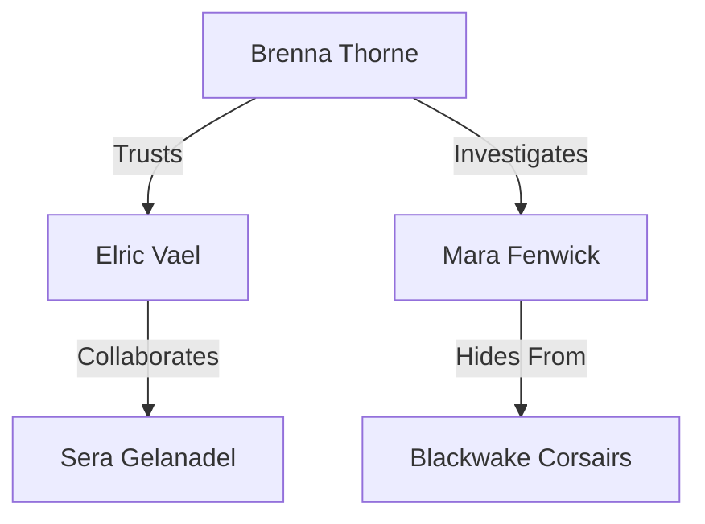
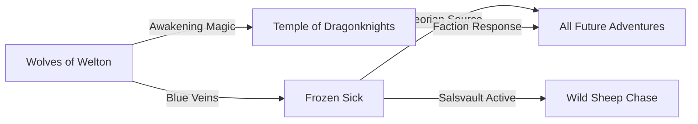
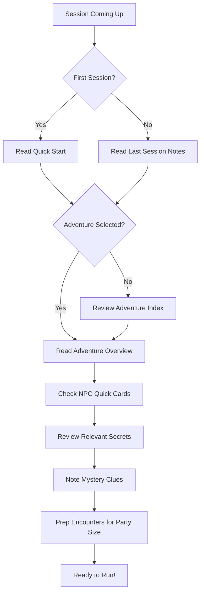

<!--
  Tags: DM-Resource, Meta
  Status: Canon
  Type: DM-Resource
-->

# A DM's Guide to Aevoria: Publication-Ready Implementation Plan

**Goal:** Transform the guide into a publication-ready DM toolkit using hybrid approach (ChatGPT structure + Claude UX enhancements)

**Scope:** Homebrewery-compatible improvements; no image migration required

---

## How to Use This Document

### For Humans
- Each task has checkboxes to track progress
- **[PARENT]** = Must be completed before children can start
- **[CHILD of X]** = Cannot start until parent X is complete
- **[PARALLEL]** = Can be done alongside other parallel tasks
- **[BLOCKER]** = Other tasks depend on this being finished

### For AI Agents
- Each task includes:
  - **Input:** What files/content to read
  - **Output:** What to create/modify
  - **Acceptance Criteria:** How to verify completion
  - **AI Prompt Template:** Suggested starting prompt

### Parallel Work Streams
Tasks marked **[PARALLEL]** can be distributed across multiple work sessions or AI conversations simultaneously.

---

## Phase 1: Foundation & Structure
**Goal:** Establish core navigation and reference framework

### 1.1 Campaign Dashboard [PARENT] [BLOCKER]

**Status:** ☐ Not Started

**Description:**  
Create a 2-page "DM Campaign Dashboard" that serves as the primary onboarding tool. Combines campaign overview, mystery summary, navigation guide, and escalation tracker.

**Input:**
- Current Chapter 1 (Welcome to Aevoria)
- Current Chapter 3 (Campaign Overview, lines 590-900)
- Chapter 6 (Aeorian Echo section, lines 9445-9598)

**Output:**  
New section: "Campaign Dashboard" (insert after Welcome, before Quick Start)
- Page 1: Campaign at a Glance
  - 1-paragraph premise
  - Information Flowchart ("How to Find What You Need")
  - Central mystery overview (3-4 sentences)
  - Starter adventure recommendations with mystery ratings
- Page 2: DM Reference Card
  - Key factions (1 sentence each)
  - Escalation timeline (what changes at different campaign stages)
  - Tone & themes
  - Common pitfalls & solutions

**Acceptance Criteria:**
- [ ] A new DM can read these 2 pages and understand how to start
- [ ] Contains clear navigation to other chapters
- [ ] Mystery is explained without spoiling specifics
- [ ] Flowchart answers "where do I find X?" for common questions

**AI Prompt Template:**
```
Read the following sections from A DM's Guide to Aevoria:
[paste relevant sections]

Create a 2-page Campaign Dashboard with:
1. One-paragraph campaign premise
2. Information flowchart (how to navigate the guide)
3. Mystery overview (no spoilers, just what it is)
4. Starter adventures with mystery rating stars
5. Key factions list
6. Escalation timeline
7. Common DM pitfalls

Format in Homebrewery-compatible markdown.
```

---

### 1.2 Adventure Index Table [PARENT] [BLOCKER]

**Status:** ☐ Not Started

**Description:**  
Create a sortable reference table for all adventures, enabling DMs to select appropriate content in under 2 minutes.

**Input:**
- All adventure modules in Chapter 5
- Current adventure summaries in Chapter 3 (lines 646-703)

**Output:**  
New section: "Adventure Index" (add to Chapter 7 Appendix)

Table format:
```markdown
| Adventure | Level | Sessions | Mystery★ | Type | Key NPCs | Echo Clue | Consequences |
|-----------|-------|----------|----------|------|----------|-----------|--------------|
```

**Columns:**
- Adventure name
- Level range
- Expected session count
- Mystery importance rating (★☆☆☆☆ to ★★★★★)
- Primary pillar (Combat/Social/Exploration/Investigation)
- Key NPCs involved
- What Echo clue it reveals
- What changes after completion

**Acceptance Criteria:**
- [ ] Includes ALL adventures from Chapter 5
- [ ] Mystery ratings align with campaign arc
- [ ] "Type" column helps DMs pick session variety
- [ ] "Consequences" column previews lasting impact
- [ ] Table is referenced from Campaign Dashboard

**AI Prompt Template:**
```
Create an Adventure Index Table for these adventures:
[paste adventure list with details]

Include: Level, Sessions, Mystery Rating (1-5 stars), Type (Combat/Social/Investigation/Exploration), Key NPCs, Echo Clue Revealed, Consequences.

Format as markdown table. Rate mystery importance based on how much it reveals about the Aeorian Echo.
```

---

### 1.3 Master Table of Contents Update [CHILD of 1.1, 1.2]

**Status:** ☐ Not Started

**Description:**  
Update the main TOC to reflect new sections and improve navigation.

**Input:**
- Completed Campaign Dashboard
- Completed Adventure Index
- Current TOC (lines 40-43)

**Output:**  
Updated Table of Contents with:
- Campaign Dashboard (new)
- Adventure Index reference in Chapter 7
- Clear section markers for DM-only content
- Page number references (if Homebrewery supports)

**Acceptance Criteria:**
- [ ] TOC includes all new sections
- [ ] Player-safe vs DM-only sections clearly marked
- [ ] Logical flow from "getting started" to "deep lore"

---

### 1.4 Information Hierarchy Documentation [PARALLEL]

**Status:** ☐ Not Started

**Description:**  
Document the information architecture so future additions maintain consistency.

**Input:**
- Completed Campaign Dashboard with flowchart
- Current chapter organization

**Output:**  
New file: `INFORMATION_ARCHITECTURE.md` (meta-document, not in published guide)

Contents:
- Information layers (Quick Reference → Public Info → Session Prep → Adventures → Secrets)
- Cross-reference rules
- When to use sidebars vs main text
- Beginner content placement guidelines

**Acceptance Criteria:**
- [ ] Clear rules for where different content types belong
- [ ] Can be referenced when adding new content
- [ ] Explains current structure decisions

**AI Prompt Template:**
```
Based on this Campaign Dashboard structure:
[paste dashboard]

And this guide organization:
[paste chapter list]

Create an information architecture document explaining:
1. Information layers and hierarchy
2. Cross-reference rules (when to link vs inline)
3. Content placement guidelines
4. Beginner vs experienced DM content strategy

This is a meta-document for maintaining consistency.
```

---

## Phase 2: Adventure Standardization
**Goal:** Apply consistent template to all adventure modules

### 2.1 Create Master Adventure Template [PARENT] [BLOCKER]

**Status:** ☐ Not Started

**Description:**  
Design the standard adventure format that will be applied to all modules.

**Input:**
- ChatGPT's proposed template structure
- Claude's enhancement suggestions
- Best practices from current "Wolves of Welton" formatting

**Output:**  
New file: `ADVENTURE_TEMPLATE.md` (template document)

Template structure:
```markdown
# [Adventure Name]

## Adventure Overview
**What Players Think This Is:** [Surface premise]
**What's Really Going On:** [DM truth]
**Mystery Rating:** ★★★★☆ (importance to Echo revelation)
**Recommended For:** [New campaign / Mid campaign / Side quest]

## Mystery Integration
**Primary Clue Delivered:** [Specific revelation]
**Backup Clues:** [Alternative discovery methods]
**Connection to Other Adventures:** [Visual diagram or list]
**If Players Miss the Clue:** [Where else it appears]

## Scene Breakdown
### Scene 1: [Name]
- Location: 
- Key NPCs:
- Encounter Type:
- Pacing Notes:
- Clue Delivery Point:

[Repeat for 3-6 scenes]

## Key NPCs (Quick Reference)
[NPC Quick Card format - see Phase 3]

## Encounter Scaling
**2 Players:** [Specific adjustments]
**3 Players:** [Run as written]
**4-5 Players:** [Specific adjustments]

## Rewards & Consequences
**Rewards:** [GP, items, reputation]
**What Changes After:**
- Short-term: [Immediate effects]
- Long-term: [Campaign ripples]
**NPCs Affected:** [Who remembers this]

## DM Preparation Checklist
- [ ] Read: [Specific sections]
- [ ] Review: [NPC secrets, clues]
- [ ] Prepare: [Maps, handouts]
- [ ] Total prep estimate: [X minutes for experienced DM]
```

**Acceptance Criteria:**
- [ ] Template includes all required sections from ChatGPT's proposal
- [ ] Incorporates Claude's Mystery Box and scaling enhancements
- [ ] Can be applied to any adventure type
- [ ] Includes guidance for completing each section

**AI Prompt Template:**
```
Create a comprehensive adventure template that combines:
1. ChatGPT's structure (What Players Think vs Reality, Consequences, Scaling)
2. Claude's additions (Mystery Boxes, Visual connections, Clue backup plans)

The template should be usable for combat-heavy, social, investigation, and exploration adventures.

Include instructional comments in brackets explaining what goes in each section.
```

---

### 2.2 Apply Template to Priority Adventures [CHILD of 2.1]

Each adventure gets its own sub-task. These can be done in parallel.

#### 2.2.1 Standardize "Wolves of Welton" [PARALLEL]

**Status:** ☐ Not Started

**Input:**
- Master Adventure Template (2.1)
- Current Wolves of Welton content (lines 2596-3500)
- Chapter 6 Welton secrets

**Output:**
- Reformatted Wolves of Welton adventure following template
- Mystery Box with clue tracking
- Updated scaling guidelines
- Visual connection to other adventures

**Acceptance Criteria:**
- [ ] Follows template exactly
- [ ] Mystery clues explicitly called out
- [ ] Scaling for 2-5 players specified
- [ ] Consequences section complete

**AI Prompt Template:**
```
Apply this adventure template:
[paste template]

To this adventure content:
[paste Wolves of Welton]

Using these secrets:
[paste relevant Chapter 6 content]

Ensure Mystery Box clearly states what players should discover about the Aeorian Echo.
```

---

#### 2.2.2 Standardize "Frozen Sick" [PARALLEL]

**Status:** ☐ Not Started

**Input:**
- Master Adventure Template (2.1)
- Current Frozen Sick content
- Chapter 6 Salsvault secrets

**Output:**
- Reformatted Frozen Sick adventure following template

**Acceptance Criteria:**
- [ ] Follows template exactly
- [ ] Emphasizes this as THE major Echo revelation adventure
- [ ] ★★★★★ mystery rating justified in Mystery Box

---

#### 2.2.3 Standardize "Temple of the Dragonknights" [PARALLEL]

**Status:** ☐ Not Started

**Input:**
- Master Adventure Template (2.1)
- Current Temple content
- Chapter 6 Temple secrets

**Output:**
- Reformatted Temple adventure following template

**Acceptance Criteria:**
- [ ] Follows template exactly
- [ ] Multiple resolution paths clearly outlined
- [ ] Consequences section covers cult destruction vs negotiation vs exposure

---

#### 2.2.4 Standardize "Wild Sheep Chase" [PARALLEL]

**Status:** ☐ Not Started

**Input:**
- Master Adventure Template (2.1)
- Current Wild Sheep Chase content
- Chapter 6 Shinebright secrets

**Output:**
- Reformatted Wild Sheep Chase following template

**Acceptance Criteria:**
- [ ] Follows template exactly
- [ ] Tone section notes this is comic relief
- [ ] Mystery connection to magic instability clear

---

#### 2.2.5 Standardize "Peril in Pinebrook" [PARALLEL]

**Status:** ☐ Not Started

**Input:**
- Master Adventure Template (2.1)
- Current Peril in Pinebrook content
- Chapter 6 Pinebrook secrets

**Output:**
- Reformatted Peril in Pinebrook following template

**Acceptance Criteria:**
- [ ] Follows template exactly
- [ ] Side quest nature clear in Overview
- [ ] Lower mystery rating (★★☆☆☆) justified

---

#### 2.2.6 Standardize Opening Adventures [PARALLEL]

**Status:** ☐ Not Started

**Input:**
- Master Adventure Template (2.1)
- Current opening encounters (lines 706-725)

**Output:**
- Reformatted opening adventures following template

**Acceptance Criteria:**
- [ ] Each opening (Wolves at Waystone, Morning After, Wolves Contract) follows template
- [ ] Connected to first full adventure clearly

---

### 2.3 Adventure Standardization Review [CHILD of 2.2.1-2.2.6]

**Status:** ☐ Not Started

**Description:**  
Review all standardized adventures for consistency and completeness.

**Input:**
- All reformatted adventures (2.2.1-2.2.6)

**Output:**
- Consistency checklist completed
- Any deviations documented and justified
- Template refined based on application learnings

**Acceptance Criteria:**
- [ ] All adventures use identical section headers
- [ ] Mystery ratings align across adventures
- [ ] Scaling guidance consistent in format
- [ ] No template sections left blank without justification

---

## Phase 3: Mystery Tools & NPC Enhancement
**Goal:** Build systematic mystery tracking and improve NPC usability

### 3.1 Build Master Clue Bank [PARENT]

**Status:** ☐ Not Started

**Description:**  
Create comprehensive database of all mystery clues with redundancy tracking.

**Input:**
- Chapter 6 Aeorian Echo explanation (lines 9445-9598)
- All standardized adventures with Mystery Boxes
- Current clue tracker (lines 1418-1443)

**Output:**  
New section: "Clue Bank & Reveal Ladder" (add to Chapter 6)

Structure:
```markdown
## Master Clue Bank

### Tier 1: Early Campaign (Strange Symptoms)
| Clue ID | Description | Appears In | Backup Locations | What It Reveals |
|---------|-------------|------------|------------------|-----------------|
| E01 | Blue veins in awakened creatures | Wolves, Frozen Sick, Temple | Any wildlife encounter | Magic is corrupting living things |
| E02 | Artifacts malfunctioning | Wild Sheep Chase, [custom] | Any magic item use | Ambient magic destabilizing |

[Continue for 10-12 early clues]

### Tier 2: Mid Campaign (The Source)
[8-10 mid-level clues]

### Tier 3: Late Campaign (The Threat)
[6-8 late clues]

## Reveal Ladder
**What Changes When Players Learn:**
- Clue E01 → Understand something is affecting wildlife
- Clues E01 + E02 + E03 → Pattern recognition: "This is widespread"
- Clue M05 → "Aeor" name first encountered
- Clue M08 → Salsvault identified as source
- Clue L01 → Someone activated it deliberately
- Clue L04 → Dimensional origin (optional reveal)

## Fail-Forward Policy
**If players miss critical clues:**
[Table showing clue redundancy and alternative delivery methods]
```

**Acceptance Criteria:**
- [ ] 25-35 total clues across three tiers
- [ ] Each clue appears in at least 2 adventures (redundancy)
- [ ] Reveal Ladder shows clear progression of understanding
- [ ] Fail-forward plan ensures mystery remains solvable

**AI Prompt Template:**
```
Create a Master Clue Bank for the Aeorian Echo mystery using:

Echo explanation:
[paste Chapter 6 Echo section]

Adventures:
[paste adventure Mystery Boxes]

Create 25-35 clues divided into:
- Tier 1 (Early): Strange symptoms, no explanation
- Tier 2 (Mid): Source discovered, stakes understood
- Tier 3 (Late): Factions mobilizing, choices matter

For each clue:
- Unique ID
- Description
- Where it appears (list all adventures)
- What understanding it provides
- Connection to other clues

Then create a "Reveal Ladder" showing what players understand at different clue thresholds.
```

---

### 3.2 Create Mystery Revelation Pacing Guide [CHILD of 3.1]

**Status:** ☐ Not Started

**Description:**  
Narrative guide helping DMs pace mystery reveals appropriately.

**Input:**
- Completed Clue Bank (3.1)
- ChatGPT's Reveal Ladder concept
- Claude's session-by-session progression suggestions

**Output:**  
New section: "Mystery Pacing Guide" (add to Chapter 6 after Clue Bank)

Structure:
```markdown
## Mystery Pacing Guide

### Sessions 1-5: Strange Symptoms
**Players Know:**
[List of knowledge]

**They Don't Know Yet:**
[List of mysteries]

**Key Clues:** E01, E02, E05, E07
**Milestone Moment:** [Specific scene that marks transition]

### Sessions 6-10: The Source
[Same structure]

### Sessions 11-15: The Threat
[Same structure]

### Session 16+: The Choice
[Same structure]

## Sample Revelation Timeline
[Session-by-session example showing when clues typically surface]

## Adjusting for Your Table
**If players are slow investigators:** [Guidance]
**If players are aggressive investigators:** [Guidance]
**If playing adventures out of order:** [Guidance]
```

**Acceptance Criteria:**
- [ ] Clear knowledge progression for each campaign stage
- [ ] Sample timeline provided as reference
- [ ] Adjustment guidance for different play styles
- [ ] Aligned with Clue Bank tiers

---

### 3.3 Design NPC Quick Card Format [PARENT]

**Status:** ☐ Not Started

**Description:**  
Create template for condensed NPC reference cards.

**Input:**
- Current NPC roster (Chapter 4, Chapter 6 secrets)
- Claude's NPC Quick Card suggestion

**Output:**  
Template document: `NPC_QUICK_CARD_TEMPLATE.md`

Format:
```markdown
## [NPC Name]

**Role:** [Title/Position]  
**Personality Tags:** [2-3 descriptors]  
**Voice:** [How they speak]

**Wants:** [Primary motivation]  
**Fears:** [What they avoid]

**Clue Delivery:**  
[What they know + when they reveal it]

**If Befriended:** [Benefit to players]  
**If Antagonized:** [Consequence]

**Secret:** [One-sentence hidden truth]  
→ *Full details: Chapter 6, page XX*
```

**Acceptance Criteria:**
- [ ] Format fits on 1/4 page or less
- [ ] Captures essential roleplay information
- [ ] References full secrets without spoiling in preview
- [ ] Includes actionable "clue delivery" guidance

**AI Prompt Template:**
```
Design a Quick Card format for NPCs that includes:
- Essential roleplay info (personality, voice)
- Motivations (wants/fears)
- How they deliver mystery clues
- Consequences of player relationships
- One-sentence secret with reference to full entry

Keep it under 100 words total. Format for easy scanning at table.
```

---

### 3.4 Create NPC Quick Cards for Core Cast [CHILD of 3.3] [PARALLEL]

**Status:** ☐ Not Started

**Description:**  
Apply quick card format to all major NPCs.

**Input:**
- NPC Quick Card Template (3.3)
- Chapter 4 NPC roster
- Chapter 6 NPC secrets (lines 9610-10700)

**Output:**  
New section: "NPC Quick Reference" (add to Chapter 7 Appendix)

Priority NPCs (create cards for):
- **Leadership Triad:** Brenna Thorne, Mara Fenwick, Elric Vael
- **Trailwardens:** Corel, Bordel, Rowan, Mila
- **Key Recurring:** Bolt, Flame, Shinebright, Sera Gelanadel
- **Adventure-Specific:** Alexi Merriksonn, Father Merriksonn, Elro Aldataur, Tulgi, Joel Andersmith

**Acceptance Criteria:**
- [ ] 15-20 core NPC quick cards created
- [ ] All cards follow template exactly
- [ ] Cards organized by category (Leadership, Field, Adventure)
- [ ] Each card references full details in Chapter 6

**AI Prompt Template:**
```
Create NPC Quick Cards using this template:
[paste template]

For these NPCs:
[paste NPC list with full details]

Each card should:
1. Capture personality for roleplay
2. Note what clues they can deliver
3. Show consequences of player relationships
4. Reference full secrets without revealing them

Organize by: Guild Leadership, Field Wardens, Adventure NPCs.
```

---

### 3.5 Create NPC Relationship Web Visual [PARALLEL]

**Status:** ☐ Not Started

**Description:**  
Visual diagram showing NPC connections, factions, and secret relationships.

**Input:**
- All NPC quick cards
- Chapter 6 NPC secrets showing relationships

**Output:**  
Visual diagram (markdown mermaid or ASCII art)
Add to Chapter 6 or Chapter 7

Example structure:
```markdown
## NPC Relationship Web

### Guild Core


### Mystery Holders vs Seekers
[Diagram showing who knows what about Echo]

### Compromised Agents
[Diagram showing NPCs with divided loyalties]
```

**Acceptance Criteria:**
- [ ] Shows key relationships between NPCs
- [ ] Highlights who knows Echo secrets
- [ ] Identifies compromised agents
- [ ] Readable at a glance

**AI Prompt Template:**
```
Create an NPC relationship diagram showing:
1. Guild hierarchy
2. Who knows what about the Aeorian Echo
3. Secret connections between NPCs
4. Compromised agents with hidden agendas

Use mermaid diagram syntax or ASCII art. Keep it scannable.

Base it on these NPC details:
[paste NPC secrets]
```

---

## Phase 4: Navigation & Cross-Reference Fixes
**Goal:** Eliminate circular references and improve information flow

### 4.1 Audit Current Cross-References [PARENT] [BLOCKER]

**Status:** ☐ Not Started

**Description:**  
Document all current cross-references to identify loops and unclear paths.

**Input:**
- Entire guide
- Claude's identified navigation problems

**Output:**  
Audit document: `CROSS_REFERENCE_AUDIT.md` (meta-document)

Contents:
```markdown
## Current Cross-Reference Patterns

### Circular References (PROBLEMS)
- Line XXX: "See Chapter 4" → Chapter 4: "See Chapter 6" → Chapter 6: "See Chapter 4"
[List all circular references]

### Multi-Hop References (INEFFICIENT)
- To find NPC secrets: Chapter 1 → Chapter 4 → Chapter 6
[List all chains longer than 2 hops]

### Redundant Content
- Aeorian Echo explained in: Chapter 3 (brief), Chapter 6 (full)
- Charter appears in: Chapter 2 (condensed), Chapter 3 (full)
[List all duplicated content]

## Recommendations
[Specific fixes for each problem]
```

**Acceptance Criteria:**
- [ ] All cross-references documented
- [ ] Circular references identified
- [ ] Redundant content noted
- [ ] Fix recommendations provided

**AI Prompt Template:**
```
Analyze this DM guide for cross-reference problems:
[paste relevant sections]

Identify:
1. Circular references (A → B → A)
2. Multi-hop chains (A → B → C)
3. Redundant content (same info in multiple places)

For each problem, suggest a fix that follows this hierarchy:
- Quick Reference (Chapter 7) → Brief version
- Main chapters → Complete version
- Secrets (Chapter 6) → DM-only details
```

---

### 4.2 Implement Cross-Reference Fixes [CHILD of 4.1]

**Status:** ☐ Not Started

**Description:**  
Apply fixes from audit to eliminate navigation problems.

**Input:**
- Cross-Reference Audit (4.1)
- Information Architecture document (1.4)

**Output:**
- Updated cross-references throughout guide
- Redundant content either removed or condensed
- Clear single-source-of-truth for each topic

**Actions:**
- [ ] Fix all circular references
- [ ] Reduce multi-hop chains to 2 hops max
- [ ] Consolidate redundant content
- [ ] Update all "See Chapter X" references to be specific: "See Chapter X: [Section Name], page XX"

**Acceptance Criteria:**
- [ ] No circular references remain
- [ ] All references point to specific sections, not just chapters
- [ ] Each topic has clear primary location
- [ ] Secondary mentions reference primary location

---

### 4.3 Add Navigation Aids [CHILD of 4.2]

**Status:** ☐ Not Started

**Description:**  
Implement breadcrumbs, section markers, and quick-find aids.

**Input:**
- Fixed cross-references
- Campaign Dashboard navigation flowchart

**Output:**
- Section header standardization
- "You Are Here" markers for complex sections
- Quick navigation boxes at chapter starts

Example:
```markdown
## Chapter 5: Adventures

**Quick Navigation:**
- Wolves of Welton → page XX
- Frozen Sick → page XX
- Temple of the Dragonknights → page XX
[etc.]

**For mystery context:** See Chapter 6: The Aeorian Echo
**For NPC secrets:** See Chapter 6: NPC Secrets
**For tracking:** See Chapter 4: Campaign Tracker
```

**Acceptance Criteria:**
- [ ] Each chapter has quick navigation box
- [ ] Section headers follow consistent hierarchy
- [ ] Key sections have "Related Reading" boxes
- [ ] Page references included where possible

---

## Phase 5: Visual Aids & Reference Materials
**Goal:** Add spatial/visual thinking aids

### 5.1 Create Northreach Region Map [PARALLEL]

**Status:** ☐ Not Started

**Description:**  
Simple node-and-connection map showing key locations.

**Input:**
- Chapter 3 geography table (lines 728-741)
- Adventure locations

**Output:**  
Map visual (ASCII art or mermaid diagram)
Add to Chapter 1 or Chapter 7

Example:
```markdown
## Northreach Region

```
              The Far North
                    ↓
              [Salsvault Ruins]
                    |
        [Temple] ← → → [Waystone Inn] ← → [Palebank]
                    |           |
              [Noke's Tower] [Welton]
                              ↓
                         [Pinebrook]
```

**Travel times:**
- Waystone → Welton: Half day
- Waystone → Palebank: 1 day
- Waystone → Temple: 2 days
- Palebank → Salsvault: 3 days
```

**Acceptance Criteria:**
- [ ] Shows relative positions of all key locations
- [ ] Includes travel time information
- [ ] Simple enough to grasp at glance
- [ ] Homebrewery-compatible format

**AI Prompt Template:**
```
Create a simple region map showing:
[paste location list with relationships]

Use ASCII art or mermaid diagram syntax.
Include:
- Relative positions
- Travel times between locations
- Which adventures occur where

Keep it simple and scannable.
```

---

### 5.2 Create Mystery Connection Diagram [PARALLEL]

**Status:** ☐ Not Started

**Description:**  
Visual showing how adventures connect through mystery clues.

**Input:**
- Master Clue Bank (3.1)
- Standardized adventure Mystery Boxes

**Output:**  
Diagram showing clue flow between adventures
Add to Chapter 6

Example:
```markdown
## Mystery Connection Web



**Clue Themes:**
- **Awakening:** Wolves, Temple
- **Corruption:** Frozen Sick, Wolves
- **Instability:** Wild Sheep Chase
- **Source:** Frozen Sick
```

**Acceptance Criteria:**
- [ ] Shows how each adventure builds on others
- [ ] Clue themes clearly labeled
- [ ] Can be used to plan adventure order
- [ ] Reveals redundancy in clue delivery

---

### 5.3 Create Adventure Difficulty Progression Chart [PARALLEL]

**Status:** ☐ Not Started

**Description:**  
Visual showing recommended adventure flow based on levels.

**Input:**
- Adventure Index Table (1.2)
- Chapter 3 adventure summaries

**Output:**  
Progression chart showing multiple valid paths
Add to Chapter 4 or Campaign Dashboard

Example:
```markdown
## Adventure Progression Paths

### Linear Path (Recommended for New Tables)
```
Level 1 → Opening Adventures → Wolves of Welton
Level 2 → Wild Sheep Chase (optional) OR Peril in Pinebrook
Level 3 → Frozen Sick (major revelation)
Level 4 → Temple of Dragonknights (capstone)
```

### Flexible Path (Experienced Tables)
```
Any Level 1-2 adventure → Frozen Sick when ready → Others as desired
```

### Mystery-Focused Path
```
Wolves (★★★★) → Frozen Sick (★★★★★) → Temple (★★★) → Others
```
```

**Acceptance Criteria:**
- [ ] Shows at least 3 valid progression paths
- [ ] Indicates required levels
- [ ] Notes which path emphasizes mystery vs flexibility
- [ ] Easy to follow visually

---

### 5.4 Create Session Prep Flowchart [PARALLEL]

**Status:** ☐ Not Started

**Description:**  
Visual guide for "what to prep before each session."

**Input:**
- Chapter 3 Session Prep Checklist (lines 870-879)
- Adventure template DM Preparation sections

**Output:**  
Flowchart for session prep process
Add to Chapter 4

Example:
```markdown
## Session Prep Flowchart


```

**Acceptance Criteria:**
- [ ] Shows decision points clearly
- [ ] Guides DM through prep process
- [ ] References correct chapters/sections
- [ ] Accounts for first session vs ongoing

---

## Phase 6: Content Enhancement & Gap Filling
**Goal:** Complete missing sections and enhance existing content

### 6.1 Build Complete Appendix (Chapter 7) [PARENT]

**Status:** ☐ Not Started

**Description:**  
Create comprehensive quick reference section.

**Input:**
- Adventure Index Table (1.2)
- NPC Quick Cards (3.4)
- Existing appendix material

**Output:**  
Complete Chapter 7 with sections:

1. **Adventure Index** (from 1.2)
2. **NPC Quick Reference** (from 3.4)
3. **Location Index**
4. **Costs & Services**
5. **Travel Times**
6. **Quick Rules Reference**
7. **Encounter Scaling Cheat Sheet**
8. **Session Report Template**

**Acceptance Criteria:**
- [ ] All 8 sections complete
- [ ] Cross-referenced from other chapters
- [ ] Formatted for at-table use
- [ ] No duplicate information from main text (just quick reference)

**AI Prompt Template:**
```
Create a complete Appendix (Chapter 7) for a DM guide with these sections:

1. Adventure Index [already created]
2. NPC Quick Reference [already created]
3. Location Index - alphabetical list of all locations with page references
4. Costs & Services - standard D&D costs plus guild-specific services
5. Travel Times - between major locations
6. Quick Rules Reference - core D&D rules (skill checks, combat, rests)
7. Encounter Scaling - adjustments for party size
8. Session Report Template - tracking sheet for each session

Format for quick at-table reference. Keep each section to 1-2 pages max.
```

---

#### 6.1.1 Location Index [CHILD of 6.1] [PARALLEL]

**Status:** ☐ Not Started

**Input:**
- All location mentions throughout guide
- Chapter 3 geography table

**Output:**
Alphabetical location index with page references

**Acceptance Criteria:**
- [ ] All locations mentioned in guide included
- [ ] Page references for first mention and major sections
- [ ] Brief one-sentence description for each

---

#### 6.1.2 Costs & Services [CHILD of 6.1] [PARALLEL]

**Status:** ☐ Not Started

**Input:**
- Standard D&D 5e costs (PHB)
- Guild-specific services from charter

**Output:**
Costs table for common items and services

**Acceptance Criteria:**
- [ ] Standard adventuring gear
- [ ] Room & board at Waystone Inn
- [ ] Healing services
- [ ] Transportation
- [ ] Guild services (research, training)

---

#### 6.1.3 Quick Rules Reference [CHILD of 6.1] [PARALLEL]

**Status:** ☐ Not Started

**Input:**
- D&D 5e basic rules

**Output:**
One-page rules summary for common situations

Contents:
- Skill checks
- Combat turn order
- Death saves
- Resting (short/long)
- Conditions

**Acceptance Criteria:**
- [ ] Covers most common table questions
- [ ] One page or less
- [ ] Clear examples
- [ ] References full rules if needed

---

#### 6.1.4 Encounter Scaling Cheat Sheet [CHILD of 6.1] [PARALLEL]

**Status:** ☐ Not Started

**Input:**
- Scaling guidance from standardized adventures
- Claude's specific scaling recommendations

**Output:**
Table showing adjustments by party size

**Acceptance Criteria:**
- [ ] Clear modifiers for 2/3/4/5 players
- [ ] HP adjustments
- [ ] Enemy count adjustments
- [ ] Resource adjustments (healing, etc.)

---

### 6.2 Add Downtime Activities System [PARALLEL]

**Status:** ☐ Not Started

**Description:**  
Expand downtime between contracts with mechanical options.

**Input:**
- Charter guild services (Chapter 3)
- NPC roster (potential trainers/mentors)

**Output:**  
New section: "Downtime at Waystone Inn" (add to Chapter 4)

Activities:
1. **Research** (with Elric)
2. **Combat Training** (with Brenna)
3. **Community Building** (with various NPCs)
4. **Crafting** (with Mara's supplies)
5. **Investigation** (following leads between contracts)

**Acceptance Criteria:**
- [ ] Each activity has mechanical benefit
- [ ] Time costs specified
- [ ] Links to relevant NPCs
- [ ] Optional rules (DM can ignore if desired)

**AI Prompt Template:**
```
Create downtime activity rules for a guild-based campaign. Activities should:
1. Be available between contracts at guild headquarters
2. Provide mechanical benefits (skill improvements, items, information)
3. Involve guild NPCs as trainers/mentors
4. Take 1-7 days each

Include: Research, Training, Crafting, Community Building, Personal Projects

Format as optional rules with mechanical benefits clearly stated.
```

---

### 6.3 Create Player Handout Document [PARALLEL]

**Status:** ☐ Not Started

**Description:**  
Extract player-safe content into separate handout.

**Input:**
- Chapter 1 (setting overview)
- Chapter 3 (charter, guild info)
- Northreach region information

**Output:**  
New document: "Player's Guide to Northwatch Wardens" (separate file)

Contents:
1. Campaign premise (player version)
2. Northwatch Wardens charter
3. Guild structure (public knowledge only)
4. Northreach overview
5. Character creation guidelines
6. Session expectations
7. Available contracts (format, rewards)

**Acceptance Criteria:**
- [ ] Contains NO DM secrets
- [ ] Contains NO Chapter 6 information
- [ ] Useful for Session 0 and reference
- [ ] Can be shared with players freely

**AI Prompt Template:**
```
Extract player-safe content from this DM guide to create a Player's Handout:

Include:
- Campaign setting overview (no mystery spoilers)
- Guild charter and structure
- Character creation guidelines
- What to expect (tone, style, format)
- Region overview (public knowledge only)

Exclude:
- Mystery details
- NPC secrets
- Adventure spoilers
- DM-only information

Format as player-facing document, friendly and inviting.
```

---

### 6.4 Add "First-Time DM" Appendix [PARALLEL]

**Status:** ☐ Not Started

**Description:**  
Consolidated beginner DM coaching in one optional section.

**Input:**
- Claude's beginner DM notes
- Quick Start session 0 tips
- Common pitfall guidance

**Output:**  
New section: "First-Time DM Guide" (add to Chapter 7 or separate appendix)

Contents:
1. **Running Session 0** (extended tips)
2. **Improvisation Techniques**
3. **When to Say Yes/No**
4. **Handling Player Surprises**
5. **Pacing Tips**
6. **Common Mistakes to Avoid**
7. **Resources for Learning**

**Acceptance Criteria:**
- [ ] Addresses common new DM anxieties
- [ ] Provides specific examples
- [ ] References relevant guide sections
- [ ] Optional (experienced DMs can skip)

**AI Prompt Template:**
```
Create a "First-Time DM Guide" appendix with:
1. Running your first session (practical tips)
2. Improvisation when players go off-script
3. Pacing (when to move on, when to linger)
4. Common mistakes and how to avoid them
5. Building confidence as DM

Keep it encouraging, practical, and specific. Include examples.

This is for DMs who may have never run a game before.
```

---

## Phase 7: Lore-to-Playable Conversion
**Goal:** Make setting sections immediately usable at table

### 7.1 Add Adventure Hooks to Major Regions [PARALLEL]

**Status:** ☐ Not Started

**Description:**  
For each major world region, provide 3 ready-to-run contract hooks.

**Input:**
- Chapter 1 region descriptions (lines 84-94)
- Existing lore sections

**Output:**  
For each region, add:

```markdown
## [Region Name]

[Existing lore content]

### Adventure Hooks for This Region

**Contract: [Name]**
- Level: X-Y
- Premise: [One-paragraph hook]
- Echo Connection: [How it ties to main mystery]
- Estimated Runtime: X sessions

[Repeat for 3 hooks per region]
```

Regions to cover:
- Northreach (already covered by main adventures)
- Solaris Dominion
- Nullwood Expanse
- Stonebound Depths
- Vharoxis
- Shattered Coast
- Emberlands
- Verdant Marches
- Far North

**Acceptance Criteria:**
- [ ] 3 hooks per region
- [ ] Each hook is a complete contract premise
- [ ] All hooks connect to Aeorian Echo somehow
- [ ] Variety of adventure types (combat/social/exploration)

**AI Prompt Template:**
```
For this region:
[paste region description]

Create 3 adventure hooks (contract premises) that:
1. Fit the region's theme and culture
2. Connect to the Aeorian Echo mystery
3. Could be run as 1-3 session adventures
4. Provide variety (combat, social, exploration)

Format as contract postings with:
- Title
- Level recommendation
- One-paragraph premise
- Echo connection
- Estimated runtime
```

---

### 7.2 Add Echo Manifestation Tables [PARALLEL]

**Status:** ☐ Not Started

**Description:**  
Random tables showing how Echo affects different regions.

**Input:**
- Chapter 6 Aeorian Echo mechanics
- Region descriptions

**Output:**  
For each region, add table:

```markdown
### Echo Manifestations in [Region]

Roll 1d10 when players travel through or investigate this region:

| d10 | Manifestation | Severity | Investigation DC |
|-----|---------------|----------|------------------|
| 1-2 | [Minor effect] | Low | 12 |
| 3-5 | [Moderate effect] | Medium | 15 |
| 6-8 | [Major effect] | High | 18 |
| 9-10 | [Critical effect] | Extreme | 20 |

[Describe each manifestation]
```

**Acceptance Criteria:**
- [ ] 10 manifestations per major region
- [ ] Escalating severity
- [ ] Thematically appropriate to region
- [ ] Investigation leads to clues

---

### 7.3 Add Consequence Charts [PARALLEL]

**Status:** ☐ Not Started

**Description:**  
Decision trees showing outcomes of major choices.

**Input:**
- Standardized adventure "Consequences" sections
- Chapter 6 world secrets

**Output:**  
For major campaign decision points, add:

```markdown
### Consequence: [Decision Point]

**If players choose A:**
- Short-term: [Immediate effects]
- NPCs affected: [Who reacts how]
- Echo impact: [How mystery progresses]
- Long-term: [Campaign ripples]

**If players choose B:**
[Same structure]

**If players choose C:**
[Same structure]
```

Key decision points:
- Wolves of Welton outcome (kill/negotiate/deceive)
- Frozen Sick Salsvault resolution
- Temple cult outcome
- Echo revelation response

**Acceptance Criteria:**
- [ ] All major decision points covered
- [ ] Multiple outcomes detailed
- [ ] NPCs and world react appropriately
- [ ] Long-term consequences specified

---

## Phase 8: Polish & Consistency
**Goal:** Final editorial pass for publication quality

### 8.1 Terminology Consistency Pass [CHILD of all previous]

**Status:** ☐ Not Started

**Description:**  
Ensure all proper nouns, terms, and references are consistent.

**Input:**
- Entire guide

**Output:**
- Consistency checklist
- Updated terminology throughout
- Style guide for future additions

Check:
- [ ] "Aeorian Echo" vs "The Echo" - consistent usage
- [ ] "Northwatch Wardens" vs "the Wardens" - consistent capitalization
- [ ] "Waystone Inn" - never "Waystone" alone
- [ ] Chapter references - consistent format
- [ ] Adventure names - consistent formatting
- [ ] NPC names - spelling consistent
- [ ] Location names - consistent
- [ ] Mystery rating format - ★★★★☆ vs 4/5 stars

**Acceptance Criteria:**
- [ ] All proper nouns spelled consistently
- [ ] Reference format consistent
- [ ] No conflicting terminology
- [ ] Style guide created for future work

---

### 8.2 Beginner Content Placement Pass [CHILD of 8.1]

**Status:** ☐ Not Started

**Description:**  
Implement strategy for beginner DM coaching placement.

**Input:**
- Claude's recommendations on beginner content
- ChatGPT's recommendation to move to sidebars
- All current beginner-focused text

**Output:**
- Beginner tips moved to callout boxes (not removed!)
- "First-Time DM" icon/marker added to relevant boxes
- Appendix contains extended beginner guidance

**Strategy:**
- Keep beginner content visible but not obstructive
- Use callout boxes with icon: 🎲 "First-Time DM"
- Short tips stay inline
- Extended tutorials go to appendix

Example:
```markdown
{{note
##### 🎲 First-Time DM Tip

When running this scene, remember players might try unexpected solutions. Say "yes, and..." when possible, then roll with it. The adventure is a guide, not a script.
}}
```

**Acceptance Criteria:**
- [ ] All beginner coaching identified
- [ ] Short tips in callout boxes
- [ ] Extended guidance in appendix
- [ ] Experienced DMs can skip easily
- [ ] New DMs see support without hunting

---

### 8.3 Redundancy Elimination Pass [CHILD of 8.1]

**Status:** ☐ Not Started

**Description:**  
Remove or consolidate duplicate information.

**Input:**
- Cross-Reference Audit (4.1)
- Entire guide

**Output:**
- Primary location established for each concept
- Secondary mentions reference primary
- Duplicate content removed or reduced to references

Key redundancies to fix:
- [ ] Aeorian Echo explanation (Chapter 3 vs Chapter 6)
- [ ] Charter text (Chapter 2 vs Chapter 3)
- [ ] NPC descriptions (multiple chapters)
- [ ] Geography info (scattered)

**Acceptance Criteria:**
- [ ] Each concept has ONE authoritative section
- [ ] Other mentions are brief with references
- [ ] No copy-paste of long sections
- [ ] Reader always knows where to find complete info

---

### 8.4 Page Number & Reference Update [CHILD of 8.3]

**Status:** ☐ Not Started

**Description:**  
Add specific page numbers to all references (if Homebrewery supports).

**Input:**
- Final guide with all content complete

**Output:**
- All "See Chapter X" updated to "See Chapter X: [Section], page XX"
- TOC includes page numbers
- Index includes page numbers
- Cross-references precise

**Acceptance Criteria:**
- [ ] No vague "see other chapter" references remain
- [ ] All references include section name
- [ ] Page numbers accurate (if possible in Homebrewery)

---

### 8.5 Homebrewery Formatting Verification [CHILD of 8.4]

**Status:** ☐ Not Started

**Description:**  
Verify all markdown renders correctly in Homebrewery.

**Input:**
- Complete guide

**Output:**
- Rendering issues documented and fixed
- Images display properly (Imgur links working)
- Tables format correctly
- Page breaks in logical places
- Callout boxes render properly

**Actions:**
- [ ] Generate full PDF from Homebrewery
- [ ] Check all tables render
- [ ] Verify all images load
- [ ] Confirm page breaks logical
- [ ] Test all markdown features used

**Acceptance Criteria:**
- [ ] Full guide renders without errors
- [ ] All images display
- [ ] Tables are readable
- [ ] Page breaks don't split important content
- [ ] Professional appearance

---

### 8.6 Final Readthrough [CHILD of 8.5]

**Status:** ☐ Not Started

**Description:**  
Complete cover-to-cover reading for final issues.

**Input:**
- Fully formatted guide

**Output:**
- Final issue list
- Corrections applied
- Sign-off for publication

**What to check:**
- [ ] Typos and grammar
- [ ] Logical flow between sections
- [ ] All promises delivered (TOC matches content)
- [ ] No internal contradictions
- [ ] Professional tone throughout
- [ ] Beginner and experienced DMs both served
- [ ] Mystery pacing makes sense
- [ ] Adventures are runnable

**Acceptance Criteria:**
- [ ] No typos in headers or critical sections
- [ ] Logical flow confirmed
- [ ] All sections complete
- [ ] Ready for publication or sharing

---

## Phase 9: Playtesting & Iteration
**Goal:** Refine based on actual table use

### 9.1 Internal Playtest [PARALLEL]

**Status:** ☐ Not Started

**Description:**  
Run the campaign using the guide with your own table.

**Input:**
- Complete guide

**Output:**
- Playtest notes document

Track:
- Where you had to hunt for information
- What sections you never used
- What you had to improvise
- What worked better than expected
- What confused you
- What confused your players

**Acceptance Criteria:**
- [ ] At least 5 sessions played
- [ ] Detailed notes taken each session
- [ ] Both "worked well" and "needs improvement" documented

---

### 9.2 External Playtest [PARALLEL]

**Status:** ☐ Not Started

**Description:**  
Have other DMs run the campaign and provide feedback.

**Input:**
- Complete guide
- Playtest questionnaire

**Output:**
- Compiled feedback from 3-5 DMs

**Acceptance Criteria:**
- [ ] At least 3 external DMs provide feedback
- [ ] Mix of experience levels
- [ ] Specific sections commented on
- [ ] Common issues identified

---

### 9.3 Implement Playtest Improvements [CHILD of 9.1, 9.2]

**Status:** ☐ Not Started

**Description:**  
Make revisions based on playtest feedback.

**Input:**
- Playtest notes (9.1, 9.2)

**Output:**
- Revised sections based on actual use
- Changelog documenting improvements

**Acceptance Criteria:**
- [ ] Common issues addressed
- [ ] Navigation improved based on DM hunting patterns
- [ ] Confusing sections clarified
- [ ] Unused sections reconsidered

---

## Critical Path Summary

**Must complete in order:**

1. **Phase 1:** Campaign Dashboard & Adventure Index [BLOCKER]
2. **Phase 2:** Adventure Template → Standardize all adventures
3. **Phase 3:** Clue Bank → Mystery Pacing Guide
4. **Phase 4:** Cross-Reference Audit → Fixes
5. **Phases 5-7:** Can proceed in parallel once Phases 1-4 complete
6. **Phase 8:** Polish (requires all content complete)
7. **Phase 9:** Playtest & iterate

**High-Impact Quick Wins:**
- 1.1 Campaign Dashboard
- 1.2 Adventure Index Table
- 2.1 Adventure Template
- 3.1 Master Clue Bank
- 6.1 Complete Appendix

**Can do anytime (parallel work):**
- Visual aids (5.1-5.4)
- NPC Quick Cards (3.4)
- Lore conversions (7.1-7.3)
- Player handout (6.3)
- First-Time DM Appendix (6.4)

---

## Success Metrics

**The guide is publication-ready when:**

- [ ] A new DM can read Campaign Dashboard and start running in < 1 hour
- [ ] Any DM can find any information in < 2 minutes
- [ ] Adventures follow consistent format
- [ ] Mystery remains solvable regardless of adventure order
- [ ] NPCs are easy to roleplay with Quick Cards
- [ ] No circular cross-references remain
- [ ] Beginner content helpful but not obstructive
- [ ] Homebrewery renders cleanly
- [ ] Playtest feedback positive

**The guide delivers on its promises when:**

- [ ] Order-independent adventures work in practice
- [ ] Variable attendance doesn't break campaign
- [ ] Mystery escalation feels natural
- [ ] Player choices have visible consequences
- [ ] DM prep time is minimal per session
- [ ] Both new and experienced DMs praise usability

---

## Version Control

**Track progress by phase:**

| Phase | Status | Completeness |
|-------|--------|--------------|
| 1. Foundation | ☐ Not Started | 0% |
| 2. Adventure Standardization | ☐ Not Started | 0% |
| 3. Mystery Tools | ☐ Not Started | 0% |
| 4. Navigation Fixes | ☐ Not Started | 0% |
| 5. Visual Aids | ☐ Not Started | 0% |
| 6. Content Enhancement | ☐ Not Started | 0% |
| 7. Lore Conversion | ☐ Not Started | 0% |
| 8. Polish | ☐ Not Started | 0% |
| 9. Playtest | ☐ Not Started | 0% |

**Update this table as you complete tasks.**

---

## Notes for Collaborators

### For Human Collaborators
- Each task is self-contained with clear inputs/outputs
- Parallel tasks can be divided among multiple people
- Use checkboxes to track progress
- Reference task numbers in commits/PRs

### For AI Collaborators
- Each task includes "AI Prompt Template" for starting
- Acceptance Criteria define success clearly
- Inputs specify what content to reference
- Outputs specify exact format needed

### For Hybrid Collaboration
- Human reviews AI output against Acceptance Criteria
- Human decides when task is complete
- AI generates content, human refines and approves
- Both track progress via checkboxes

---

## GitHub Issue Creation

**To create issues from this document:**

1. Create one issue per Phase (9 issues total)
2. Create sub-issues for each major task (2.1, 3.1, etc.)
3. Link child issues to parent issues
4. Tag issues: `enhancement`, `documentation`, `blocker`, `parallel`
5. Add milestones for phases
6. Use project board to track progress

**Example Issue Title:**  
`[Phase 2.1] Create Master Adventure Template`

**Example Issue Labels:**  
`phase-2`, `blocker`, `template`, `documentation`

---

## Maintenance After Publication

**Keep guide current:**
- [ ] Add new adventures using standard template
- [ ] Update Clue Bank when adding mysteries
- [ ] Maintain NPC Quick Cards as characters evolve
- [ ] Update Adventure Index with new content
- [ ] Document homebrew additions

**For future seasons:**
- [ ] This template applies to Season 2+ content
- [ ] Maintain same structure and quality
- [ ] Reference this plan when adding content

---

**Last Updated:** [Current Date]  
**Guide Version:** Pre-Publication  
**Total Tasks:** 70+  
**Status:** Planning Phase
